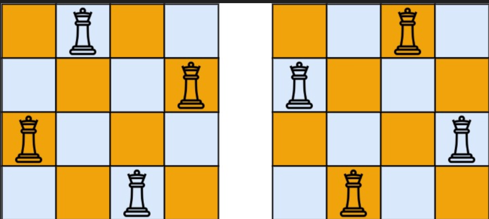
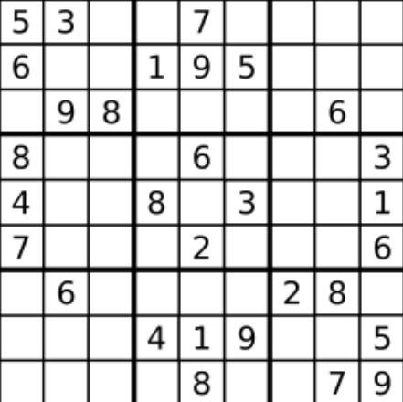

>按照国际象棋的规则，皇后可以攻击与之处在同一行或同一列或同一斜线上的棋子。
n皇后问题研究的是如何将n个皇后放置在`n×n`的棋盘上，并且使皇后彼此之间不能相互攻击。给你一个整数`n` ，返回所有不同的`n`皇后问题的解决方案。每一种解法包含一个不同的`n`皇后问题 的棋子放置方案，该方案中`'Q'`和`'.'`分别代表了皇后和空位。


::: tip 例子
`输入`：n = 4

`输出`：[[".Q..","...Q","Q...","..Q."],["..Q.","Q...","...Q",".Q.."]]

`解释`：如上图所示，4 皇后问题存在两个不同的解法。
:::
::: warning 解题思路
通过遍历回溯的方式，不断地尝试可以放置皇后的位置。

问题的难点就在于如何标记哪些位置不可以继续放置皇后；

`col`：标记列是否可以使用

`right_Diagonal`： 标记主对角线上是否可以放置   <trueBlock>col+row</trueBlock>:标记唯一

`left_Diagonal`：标记副对角线上是否可以放置  <trueBlock>n-1-col-row</trueBlock>:标记唯一
:::
``` c
#include <iostream>
#include <vector>
#include <string>

using namespace std;

class Solution {
public:
    // 用来记录每一列是否已经放置了皇后
    int col[9]={0};
    
    // 记录主对角线上的单元格是否被占据（右下方向）
     int right_Diagonal[18]={0};

     // 记录副对角线上的单元格是否被占据（左下方向）
     int left_Diagonal[18]={0}; 

    vector<string> path;   // 存储当前路径(也就是当前部分解)
    vector<vector<string>> ans;   // 存储所有可能结果

   
    void tractBack(int layer,int n){
        if(path.size()==n){  
            ans.push_back(path);  /// 如果路径长度等于棋盘边长, 就将其添加到答案中.
            return;
        }
        
         string s(n,'.'); 
         
         for(int i=0;i<n;i++){
             /* 判断在第layer行第i列位置放一个皇后会不会和之前摆好位置得到冲突 */
            if(col[i]==1 || right_Diagonal[i+layer]==1 ||left_Diagonal[n-1-i+layer]==1){
                continue;
            }
              
            /* 在该处放置皇后 */
            col[i]=1;  // 列被占据
            right_Diagonal[i+layer]=1;   // 主对角线被占据
            left_Diagonal[n-1-i+layer]=1;  // 副对角线被占据
              
            s[i]='Q';   // 在棋盘上放置皇后 
            path.push_back(s);    /// 添加到路径中

            /* 进行下一层决策 */
            tractBack(layer+1,n);

             /* 回溯，撤销刚才的选择, 尝试其他可能性*/
             path.pop_back();   
            col[i]=0;
            right_Diagonal[i+layer]=0;
            left_Diagonal[n-1-i+layer]=0;
            s[i]='.';  
        }
    }

    vector<vector<string>> solveNQueens(int n) {
         tractBack(0,n);
         return ans;
    }
};

```
>编写一个程序，通过填充空格来解决数独问题。数独的解法需 遵循如下规则：
(1)数字 1-9 在每一行只能出现一次。
(2)数字 1-9 在每一列只能出现一次。
(3)数字 1-9 在每一个以粗实线分隔的 3x3 宫内只能出现一次。（请参考示例图）
数独部分空格内已填入了数字，空白格用 '.' 表示。




::: info 示例
`输入`：board = [["5","3",".",".","7",".",".",".","."],["6",".",".","1","9","5",".",".","."],[".","9","8",".",".",".",".","6","."],["8",".",".",".","6",".",".",".","3"],["4",".",".","8",".","3",".",".","1"],["7",".",".",".","2",".",".",".","6"],[".","6",".",".",".",".","2","8","."],[".",".",".","4","1","9",".",".","5"],[".",".",".",".","8",".",".","7","9"]]

`输出`：[["5","3","4","6","7","8","9","1","2"],["6","7","2","1","9","5","3","4","8"],["1","9","8","3","4","2","5","6","7"],["8","5","9","7","6","1","4","2","3"],["4","2","6","8","5","3","7","9","1"],["7","1","3","9","2","4","8","5","6"],["9","6","1","5","3","7","2","8","4"],["2","8","7","4","1","9","6","3","5"],["3","4","5","2","8","6","1","7","9"]]

解释：输入的数独如上图所示，唯一有效的解决方案如下所示：
:::

::: warning 第一次
通过简单的回溯，此次代码中出现的问题就是，在明知道一条路已经是死路，但是还是继续遍历下去，没有剪枝优化
``` c
#include <iostream>
#include <vector>
#include <string>
using namespace std;
class Solution {
public:
    int row[9][10]={0};
    int col[9][10]={0};
    int repeat[9][10]={0};
    int count=0;
    int findIndex(int i,int j){
        if(i<=2){
            if(j<=2) return 0;
            else if(j<=5) return 1;
            else return 2;
        }
        else if(i<=5){
            if(j<=2) return 3;
            else if(j<=5) return 4;
            else return 5;
        }else{
            if(j<=2) return 6;
            else if(j<=5) return 7;
            else return 8;
        }
    }
    bool tractBack(vector<vector<char>>& board,int layer,int startIndex){
        if(count==81){
            return true;
        }
        if(startIndex>=9) {
            startIndex=0;
            layer++;
        }
        for(int i=startIndex;i<9;i++){
            if(board[layer][i]!='.') continue;
            int index=findIndex(layer,i);
            for(int j=1;j<=9;j++){    
                if(row[layer][j]==1 || col[i][j]==1 || repeat[index][j]==1) continue;
                board[layer][i]=j+'0';
                row[layer][j]=1;
                col[i][j]=1;
                repeat[index][j]=1;
                count++;
                if(tractBack(board,layer,i+1)) return true;
                count--;
                board[layer][i]='.';
                row[layer][j]=0;
                col[i][j]=0;
                repeat[index][j]=0;
            }
            return false;
        }
        if(layer==8) return true;
        else if(tractBack(board,layer+1,0)) return true;
        return false;
        
    }
  
    void solveSudoku(vector<vector<char>>& board) {
        for(int i=0;i<9;i++){
            for(int j=0;j<9;j++){
                char c=board[i][j];
                if(board[i][j]!='.'){
                    row[i][c-'0']=1;
                    col[j][c-'0']=1;
                    int index=findIndex(i,j);
                    repeat[index][c-'0']=1;
                    count++;
                }
            }
        }
        tractBack(board,0,0);
   
    }
};
```
:::

::: warning 改进
在第一次的基础上，进行一定的改进，如果发现一条路已经走不通了，立即返回
``` c {53}
#include <iostream>
#include <vector>
#include <string>
using namespace std;
class Solution {
public:
    int row[9][10]={0};
    int col[9][10]={0};
    int repeat[9][10]={0};
    int count=0;
    int findIndex(int i,int j){
        if(i<=2){
            if(j<=2) return 0;
            else if(j<=5) return 1;
            else return 2;
        }
        else if(i<=5){
            if(j<=2) return 3;
            else if(j<=5) return 4;
            else return 5;
        }else{
            if(j<=2) return 6;
            else if(j<=5) return 7;
            else return 8;
        }
    }
    bool tractBack(vector<vector<char>>& board,int layer,int startIndex){
        if(count==81){
            return true;
        }
        if(startIndex>=9) {
            startIndex=0;
            layer++;
        }
        for(int i=startIndex;i<9;i++){
            if(board[layer][i]!='.') continue;
            int index=findIndex(layer,i);
            for(int j=1;j<=9;j++){    
                if(row[layer][j]==1 || col[i][j]==1 || repeat[index][j]==1) continue;
                board[layer][i]=j+'0';
                row[layer][j]=1;
                col[i][j]=1;
                repeat[index][j]=1;
                count++;
                if(tractBack(board,layer,i+1)) return true;
                count--;
                board[layer][i]='.';
                row[layer][j]=0;
                col[i][j]=0;
                repeat[index][j]=0;
            }
        }
        return false; //如果这条路走不通，立即返回
    }
  
    void solveSudoku(vector<vector<char>>& board) {
        for(int i=0;i<9;i++){
            for(int j=0;j<9;j++){
                char c=board[i][j];
                if(board[i][j]!='.'){
                    row[i][c-'0']=1;
                    col[j][c-'0']=1;
                    int index=findIndex(i,j);
                    repeat[index][c-'0']=1;
                    count++;
                }
            }
        }
        tractBack(board,0,0);
   
    }
};
```
:::


::: warning 另一种思路
使用二维递归实现，但是总的思路来说，还是相同的

``` c
#include <iostream>
#include <vector>
#include <string>
using namespace std;
class Solution {
public:
    int row[9][10]={0};
    int col[9][10]={0};
    int repeat[9][10]={0};
    int count=0;
    int findIndex(int i,int j){
        if(i<=2){
            if(j<=2) return 0;
            else if(j<=5) return 1;
            else return 2;
        }
        else if(i<=5){
            if(j<=2) return 3;
            else if(j<=5) return 4;
            else return 5;
        }else{
            if(j<=2) return 6;
            else if(j<=5) return 7;
            else return 8;
        }
    }
    bool isValid(int i,int j,int val){
        int index=findIndex(i,j);
        if(row[i][val]==1 || col[j][val]==1 || repeat[index][val]==1)
        return false;
        row[i][val]=1;
        col[j][val]=1;
        repeat[index][val]=1;
        return true;
        
    }
    bool tractBack(vector<vector<char>>& board){
        for(int i=0;i<9;i++){
            for(int j=0;j<9;j++){
                if(board[i][j]!='.') continue;
                for(int val=1;val<=9;val++){
                    if(isValid(i,j,val)){
                        board[i][j]='0'+val;
                        if(tractBack(board)) return true;
                        board[i][j]='.';
                        int index=findIndex(i,j);
                        row[i][val]=0;
                        col[j][val]=0;
                        repeat[index][val]=0;
                    }
                }
                return false;
            }
        }
        return true;
    }
  
    void solveSudoku(vector<vector<char>>& board) {
        for(int i=0;i<9;i++){
            for(int j=0;j<9;j++){
                char c=board[i][j];
                if(board[i][j]!='.'){
                    row[i][c-'0']=1;
                    col[j][c-'0']=1;
                    int index=findIndex(i,j);
                    repeat[index][c-'0']=1;
                    count++;
                }
            }
        }
        tractBack(board);
   
    }
};
```

:::