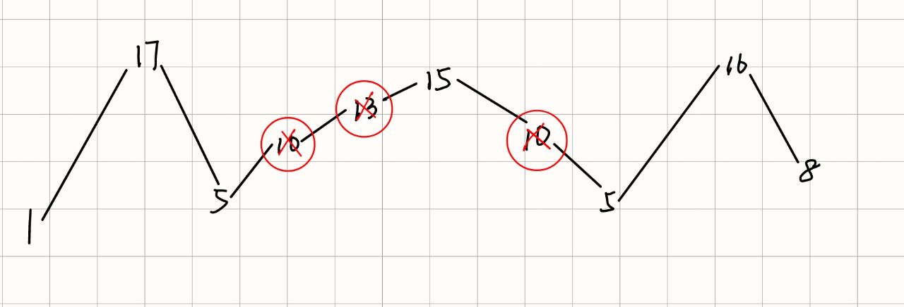
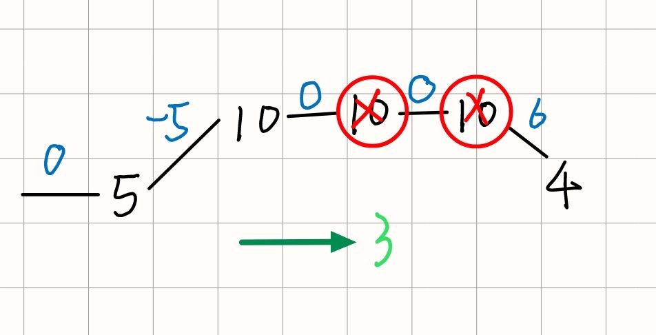
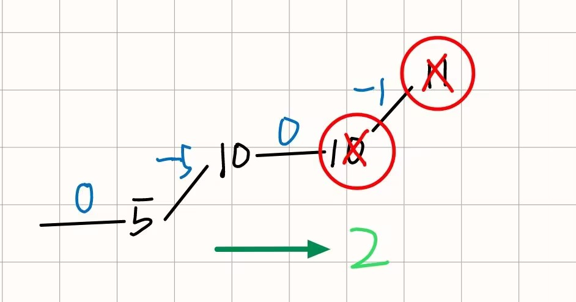

::: info 摆动序列
如果连续数字之间的差严格地在正数和负数之间交替，则数字序列称为`摆动序列`。第一个差(如果存在的话)可能是正数或负数。仅有一个元素或者含两个不等元素的序列也视作摆动序列。

1. 例如， [1, 7, 4, 9, 2, 5] 是一个 摆动序列 ，因为差值 (6, -3, 5, -7, 3) 是正负交替出现的。

2. 相反，[1, 4, 7, 2, 5] 和 [1, 7, 4, 5, 5] 不是摆动序列，第一个序列是因为它的前两个差值都是正数，第二个序列是因为它的最后一个差值为零。
子序列 可以通过从原始序列中删除一些（也可以不删除）元素来获得，剩下的元素保持其原始顺序。

给你一个整数数组 nums ，返回 nums 中作为 摆动序列 的 最长子序列的长度 。 
:::
::: tip 例子
`输入`：nums = [1,17,5,10,13,15,10,5,16,8]

`输出`：7

`解释`：这个序列包含几个长度为 7 摆动序列。
其中一个是 [1, 17, 10, 13, 10, 16, 8] ，各元素之间的差值为 (16, -7, 3, -3, 6, -8) 。
:::


::: warning 贪心解法
<div style="display: flex; justify-content: center;">
    
</div>

`局部最优`：删除单调坡度上的节点，那么这个坡度就可以有两个局部峰值

`整体最优`：整个序列有多个局部峰值，从而达到最长摆动序列

`preDiff`：前一对差值
`curDiff`：当前差值

如果 preDiff * curDiff < 0 出现局部峰值

<trueBlock>第一种特殊情况</trueBlock>：

<div style="display: flex; justify-content: center;">
    
</div>

中间有平坡，但是很明显坡开始的地方是可以被看做峰值进行记录的；此时 `preDiff =0 curDiff<0 `;
同时，如果反方向的话 就是 `preDiff=0 curDiff>0`

<trueBlock>第二种特殊情况</trueBlock>：

<div style="display: flex; justify-content: center;">
    
</div>

前面考虑的`preDiff `更新的方式，每次直接 `preDiff=curDiff ` 但是会出现这种一直上坡的情况不可解决，我们需要当 `curDiff=0` 的时候，不更新 `preDiff`

``` c {15}
#include <iostream>
#include <vector>
using namespace std;
class Solution {
public:
    int wiggleMaxLength(vector<int>& nums) {
        if(nums.size()<=1) return nums.size();
        int preDiff=0;
        int curDiff=0;
        int len=nums.size();
        int count=1;
        for(int i=0;i<len-1;i++){
            curDiff=nums[i]-nums[i+1];
            if(preDiff*curDiff<0 ||  (preDiff==0&& curDiff<0) || (preDiff==0&&curDiff>0)) count++;
            if(curDiff!=0) preDiff=curDiff;
        }
        return count;
    }
};
```
:::
::: warning DP
1. `dp[i][0]`：表示前i个数，第i个数作为作为山峰的摆动子序列的最长长度
2. `dp[i][1]`：表示前i个数，第i个数作为山谷的摆动子序列的最长长度
   
**转移方程**
- dp[i][0]=max(dp[i][0],dp[j][1]+1);
  
`0<j<i && nums[j]<nums[i]`
- dp[i][1]=max(dp[i][1],dp[j][0]+1)；
  
`0<j<i && nums[j]>nums[i]`
``` c
#include <iostream>
#include <vector>
using namespace std;
class Solution {
public:
    int dp[1005][2];
    int wiggleMaxLength(vector<int>& nums) {
        memset(dp,0,sizeof(dp));
        dp[0][0]=dp[0][1]=1;
        for(int i=1;i<nums.size();i++){
            dp[i][0]=dp[i][1]=1;
            for(int j=0;j<i;j++){
                if(nums[j]>nums[i]){
                    dp[i][1] = max(dp[i][1], dp[j][0] + 1);
                }
            }
            for(int j=0;j<i;j++){
                if(nums[j]<nums[i]){
                    dp[i][0]=max(dp[i][0], dp[j][1] + 1);
                }
            }    
        }

        return max(dp[nums.size()-1][1],dp[nums.size()-1][0]);
    }
};
```
:::


::: info
给你一个整数数组`nums` ，请你找出一个具有最大和的连续子数组（子数组最少包含一个元素），返回其最大和。子数组是数组中的一个连续部分
:::

::: tip 例子
`输入`：nums = [-2,1,-3,4,-1,2,1,-5,4]
`输出`：6
`解释`：连续子数组 [4,-1,2,1] 的和最大，为 6 。
:::

::: warning 贪心解法

其实就是要想到，如果我的加和是负数，很明显他会拉低下一次的加和总值，也就是所以，一旦得到负值就放弃当前的总和，以下一个数为起点继续计算
``` c  js:line-numbers
#include <iostream>
#include <vector>
using namespace std;
class Solution {
public:
    int maxSubArray(vector<int>& nums) {
        int len=nums.size();
        int sum=0;
        int max_val=INT_MIN;  // int_min int类型的最小值
        for(int i=0;i<len;i++){
            sum+=nums[i];
            if(max_val<sum) max_val=sum;   // 在置为0的之前，先比较一下，防止最大值就是一个负数
            if(sum<0) sum=0;
            
        }
        return max_val;

    }
};
```
:::

::: warning 动态规划
使用`dp`数组标记以第`i`元素结尾的连续数组的最大值，计算公式`dp[i]=max(dp[i-1]+nums[i],nums[i])`

``` c
#include <iostream>
#include <vector>
using namespace std;
class Solution {
public:
    int maxSubArray(vector<int>& nums) {
       vector<int> dp(nums.size(),0);
       int result=nums[0];
       dp[0]=nums[0];
       for(int i=1;i<nums.size();i++){
        dp[i]=max(dp[i-1]+nums[i],nums[i]);

        if(dp[i]>result) result=dp[i];
       }
       return result;

    }
};
```
:::