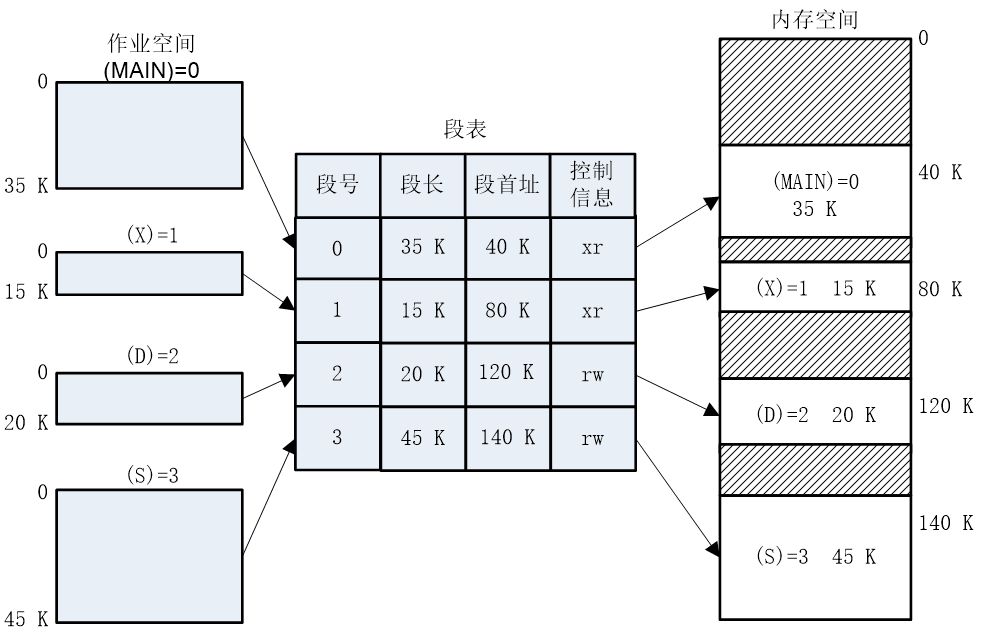

# 基本内存管理

## 🏕️程序的加载和链接

### 高级语言源代码转化基本步骤
1. `编译`：编译器将用户源代码编码编译成若干个目标模块
2. `链接`：链接器将编译后形成的一组目标模块，以及它们所需要的库函数链接在一起，形成一个完整的装入模块
3. `加载(装入)`：由加载器将装入模块装入内存

### 空间分类

**名空间**

名字空间可以理解为标识符（变量、函数等）的容器。通过使用名字空间，我们可以组织代码，并防止命名冲突

**逻辑空间**

由源程序进过汇编或编译后，形成目标程序，每个目标程序都是以0为基址顺序进行编址的，原来使用符号名访问的单元用具体的数据--单元号取代。这样生成的目标程序占据一定的地址空间，称为逻辑地址空间，在逻辑空间中的每条指令的地址和指令中要访问的操作数地址统称为逻辑地址

**内存空间(物理空间)**

内存是由若干个存储单元组成的，每个存储单元有一个编号，这种编号可以标识一个存储空间，称为内存地址(物理地址)

### 链接

源程序经过编译后，可得到一组目标模块，在利用链接程序将这组程序将这组目标模块链接形成加载模块

**静态链接**

在程序运行之前，先将各目标模块及它们所需的库函数，链接成一个`完整的加载模块`，以后不在拆分开

::: danger 问题
1. `相对地址的修改`：由编译程序产生的所有目标模块中，使用的都是相对地址，其起始地址都为0，在链接成一个加载模块时修改模块的相对地址
   
2. `变换外部引用地址`：将每个模块中所调用的外部符号也都变化成相对地址
:::

> 缺点：不利于代码的共享、不利于模块的独立升级、链接一些不会执行的模块，浪费存储空间和处理时间

**动态链接**

::: info  加载时动态链接
目标模块在装入内存时，采用边装入边链接的链接方式

<trueBlock>优点：</trueBlock>

- 便于每个模块的独立升级
- 便于模块之间的共享
  

<warnBlock>缺点：</warnBlock>

- 可能会链接一些不会执行的模块，浪费存储空间和处理时间
- 模块装入后不能移动位置
:::

::: info 运行时动态链接

对某些目标模块的连接，是在程序执行中需要该模块时，由操作系统去找到该模块并将之装入内存，随后把它链接到调用者模块上

<trueBlock>优点：</trueBlock>

- 只有执行需要的目标模块才会被调入内存和装入模块上，节省了大量的内存空间

:::

### 装入

**绝对加载方式**

- 在编译时就知道程序将驻留在内存中的具体位置，编译程序产生绝对地址的目标代码
- 绝对加载程序按照装入模块中的地址，将程序和数据装入内存。装入模块在装入内存时，由于程序中的逻辑地址与实际内存地址完全相同，不需要对程序和数据地址进行修改
- 为了便于程序的修改，对编译的程序采用符号地址，然后在编译或汇编，再将这些符号地址转换成绝对地址

<trueBlock>优点：</trueBlock>
 实现简单，无须进行逻辑地址到物理地址的转换
<warnBlock>缺点：</warnBlock>
- 程序每次必须装入同一内存区
- 程序必须事先了解内存的使用情况，根据内存情况确定程序的逻辑地址
- 不适合多道程序系统

**可重定位(静态重定位)加载方式**
- 编译时采用相对地址，编译器假设是装入到从零开始的内存位置
- 允许将程序装入与逻辑地址不同的物理内存空间。即程序可以装入到内存的任何位置，其逻辑地址与装入内存后的物理地址无直接关系
- 必须进行重定位，即装入程序根据装入的位置将逻辑地址转化为物理地址
- 静态重定位技术：地址映射在程序装入时进行，以后不在更改程序地址

<trueBlock>优点：</trueBlock> 
易实现，无需硬件支持

<warnBlock>缺点：</warnBlock>

- 程序重定位后就不能移动，因而不能重新分配内存，不利于内存的有效利用
- 程序在存储空间中只能连续分配，不能分布在内存的不同区域
- 难于共享

**运行时重定位(动态重定位)加载方**

- 程序的地址转换不是在装入时进行，而是在程序运行
- 运行时动态装入需要硬件支持，即重定位寄存器，用于保存程序在内存中的起始地址
- 程序被执行时，通过重定位寄存器内的起始物理地址和指令或数据的逻辑地址计算其物理地址

<trueBlock>优点：</trueBlock>

- 程序不必连续存放在内存中，可分散存储，可以移动
- 便于共享
- 有利于紧凑、碎片化的解决
- 主流方式

<warnBlock>缺点：</warnBlock>

- 需要硬件支持，实现存储管理的软件算法比较复杂
- 同一地址，可以多次转化
- DLL Hell：两个或更多进程共享一个DLL模块，但他们希望链接不同版本的模块

## 🏜️内存管理的需求

### 重定位

进程应该能够被装载到内存中的任意位置，并在运行时可能会被移动。这就需要地址空间中的所有引用都能够被正确地转换和解析。

- 程序员事先并不知道在某个程序执行期间会有其他哪些程序驻留在内存中
- 需要把活动进程换入或换出内存，进而使处理器的利用率最大化
- 进程下次换入时要放置在与换出前相同的区域存在诸多的困难
- 需要将进程重定位到内存的不同区域

### 保护(硬件实现)

每个进程应该受到保护，不允许其他进程无权限访问其私有地址空间。同时，用户程序也不能直接访问系统核心区域或者其他关键资源

- 进程以外的其他进程中的程序不能未授权的访问(进行读操作或写操作)该进程的内存单元
- 程序在内存中的位置不可预测
- 需要既要支持重定位也要支持保护机制

### 共享
- 多个进程正在执行同一程序时，允许每个进程访问该程序的同一个副本，要比让每个进程有自己独立的副本更加有利
- 需要既支持重定位也支持共享的机制

### 逻辑组织

为了更好地利用内存并且简化编程模型, 内存通常按段(segmentation)或页(paging)等形式进行组织。比如我们将代码、数据和堆栈放入不同段使得结构清晰且方便管理
- 内存被组织成线性(或一维)地址空间
- 分段可以满足该需求

::: tip 程序按模块组织 
- 可以独立编写和编译模块
- 可以为不同大的模块提供不同的保护级别(只读、只执行)
- 模块可以被多个进程共享，与用户看待问题的方式不一致
:::

### 物理组织

- 不应该让程序员负责管理内存，程序员不知道可用空间的大小与位置
- 供程序和数据使用的内存可能不足
  
使用覆盖技术实现：允许不同的模块占用相同的存储空间，但是编程耗时

## 🏛️内存管理

### 固定分区

操作系统占据内存中某些固定的部分，用户进程使用其余部分；将用户空间的内存区域进行划分，形成若干个边界固定的区域，每一分区装入一个进程

**分区大小相等**
- 程序可能由于大于一个分区的大小，只可以通过`覆盖`技术设计程序
- 很小的程序也必须占用一个完整的分区，会浪费分区内部一些空间

**分区大小不相同**

使用大小不同的固定分区虽然带来一定的灵活性，实现的方式也比较简单，但是却也有很大的缺陷：

1. 分区的数量在系统生成阶段已经确定，限制了系统活动(未挂起)进程的数量
2. 小作业任然不可以有效的利用分区的空间，在固定分区的情况下，总有分区会被利用不够充分

### 动态分区

不同于固定分区，动态分区为每个程序分配空间动态进行，也就是不会产生内部碎片。但是同时会出现的问题是：`外部碎片`,不同程序之间会出现一些没有利用的空间

`紧凑(压缩)`:解决外部碎片的问题，操作系统控制程序移动，使程序占用连续的空间，所有外部碎片压缩到一起，形成一片空间，但是同时这种操作是非常浪费处理器时间的

|    算法          | 思想| 实现|评价|
| ------------- |:-------------: | :-------------: |:-------------: |
|首次匹配 | 从头开始扫描内存，选择大小足够的第一个可用块  |要求空闲分区以地址递增的顺序链接，从链首开始查找|简单，快速 为大作业分配大的空间创造了条件 内存前端出现很多的小的空闲区域，每次查找都要经过这些分区 |
|下次/循环匹配|从上一次放置的位置开始扫描，选择一个大小足够的可用块  | 空闲分区按地址从低到高排列|比首次匹配性能差，常常在内存末尾分配空间，导致空闲的分区分布均匀 缺少大的空闲块，需要更多次数紧凑  |
|最佳匹配|选择空间大小与需求最接近的空闲块分配 |空闲分区按容量从大到小链接|产生的外部碎片很小 内存中形成很多小到无法满足任何分配需求的快 需要更频繁的进行内存压缩|
|最差匹配|选择满足要求的最大的空闲分区分配 |空闲分区按容量从大到小链接|酶促分配留下的空闲空间较大，便于再次利用 大的空间不容易保留，对大作业不利|

**分配**

`计算需要空间`->`按照算法进行分配`->`从空闲分区表中删除该项`->`从分区总划分出空间`->`重新计算剩余部分和起始地址`->`将剩余的部分作为空闲分区加入空闲分区表`

**回收**

一个进程运行完毕释放内存时，合并相邻的空闲分区

### 伙伴系统

综合静态划分技术和动态划分技术的优点

**思想**

无论已分配分区或空闲分区，其大小均为2的k次幂，k为整数，l≤k≤m，其中：表示2^1分配的最小分区的大小，2^m表示分配的最大分区的大小，通常是整个可分配内存的大小。

假设系统的可利用空间容量为2^m个字节，则系统开始运行时，整个内存区是一个大小为2^m的空闲分区。在系统运行过程中，由于不断的划分，可能会形成若干个不连续的空闲分区，将这些空闲分区根据分区的大小进行分类，对于每一类具有相同大小的所有空闲分区，单独设立一个空闲分区双向链表。这样，不同大小的空闲分区形成了k个空闲分区链表

**分配规则**

进程申请大小为k的空间，系统为之分配一个2^i的空闲分区，其中，2^i-1＜k≤2^i
1. 查找大小为2^i的空闲分区，若找到则分配
2. 若未找到大小为2^i的空闲分区，则查找大小为2^(i+1)的空闲分区；若找到，则将该空闲分区划分为相等的两个分区（一对`伙伴`），其中的一个用于分配，另一个分区加入大小为2^i的空闲分区链中
3. 若未找到2^(i+1)的空闲分区，则需要查找大小为2^(i+2)的空闲分区，若找到则需要进行两次划分。第一次将其分割为大小为2^(i+1)的两个分区，一个用于分配，另一个加入到大小为2^(i+1)的空闲分区链中；第二次将第一次用于分配的空闲分区分割为2^i的两个分区，一个用于分配，另一个加入到大小为2^i的空闲分区链中
4. 若仍未找到2^(i+2)的空闲分区，则继续查找2^(i+3)的空闲分区，以此类推。

**回收规则**

当进程执行完毕，释放一个大小为2^i的分区时，系统用下面的算法回收该分区
1. 若事先不存在2i的空闲分区，则保留该分区为一个独立的空闲分区
2. 若事先已存在2^i的空闲分区时，则将其与`伙伴分区`合并为大小为为2^(i+1)的空闲分区
3. 若事先已存在2^(i+1)的空闲分区时，继续合并为2^(i+2)的空闲分区，以此类推

**特点**
- 较为合理的折中方案，一定程度上克服了动态分区和固定分区的缺陷
- 是并行程序分配和释放的一种有效的方案
- UNIX内核存储就是使用一种改进的伙伴系统

### 重定位

**引入原因**
- 进程被多次装入内存时，可能位于内存中的不同位置
- 压缩技术导致进程位置的移动

**硬件支持**
- 基址寄存器
- 界限寄存器

**可重定位分区分配**

采用动态重定位技术的分区分配，正常情况下根据动态分区进行分区，如果找不到可以区域，但同时内存中的碎片空间总和大于需要空间，进行空间压缩后进行分配

### 对换

通过大容量的辅存在逻辑上实现内存的扩充，来解决内存容量不足的问题

**问题的提出**
- 一个进程的逻辑地址空间大于内存可以使用空间的时候，该进程就不可以装入使用
- 当并发运行作业程序地址空间大于内存空间时，多道程序设计就会碰到很大的问题

**覆盖**

一个程序的几个代码段或数据段，按照时间先后来占用公共的内存空间

`实现`：
1. 将程序必要部分的代码和数据常驻内存
2. 可选部分在其他程序模块中实现，平时存放外存中，需要用到时才装入内存
3. 不存在调用关系的模块不必同时装入内存中，可相互覆盖
<trueBlock>优点：</trueBlock>

覆盖实现不需要OS提供特殊的支持

<warnBlock>缺点：</warnBlock>

程序员必须适当的设计和编写覆盖结构，编程时必须划分程序模块和确定程序模块之间的覆盖关系，增加编程复杂度

**交换**

把内存中暂不能运行的进程或者暂不使用的程序和数据换出到外存上，以腾出足够的内存空间，把已具备运行条件的进程或进程所需要的程序和数据换入内存

::: info  对换
交换粒度：
   - 整体交换：交换以整个进程为单位
   - 部分交换：分页、分段为基础，目的是支持虚拟存储系统
优点：换入与换出由内存管理模块完成，与程序结构无关
:::

## 🏞️离散分配方式

一个进程分配的空间由多个离散的空间组成

**引入原因**
- 固定分区存在内部碎片
- 动态分区存在外部碎片
- 可重定位动态分区系统开销大

### 分页

将内存与进程划分为同样固定大小、相等的块，且块相对较小

`页`：进程中的块

`页框`：内存中的块

**页表**

操作系统为每个进程维护一个页表，页表给出该进程的每页对应页框的位置。逻辑地址到物理地址的转化由处理器完成

> 逻辑地址结构：页号+页内偏移量

::: tip 页号与页内地址的计算
对于某特定机器，其地址结构是一定的。若给定一个逻辑地址空间中的地址为A，页面的大小为L，则页号P和页内地址d可按下式：

$$p=\left \lfloor \frac{A}{L}  \right \rfloor $$

$$d=A\  mod \ L$$
:::

**页表的存储**
- 页表存放在内存
- PCB保存有页表的起始地址
- 页表寄存器存放当前运行进程的页表的起始地址（提高访问的速度）

**评价**

<trueBlock>优点：</trueBlock>

- 存在页内碎片，但碎片相对较小，内存利用率较高
- 实现了离散分配
- 无外部碎片

<warnBlock>缺点：</warnBlock>

- 需要专门的硬件支持，尤其是快表

### 分段

一个程序可以划分成几个段，每个段的长度可以不相同，但是都是从0开始编址，并占用一段连续的地址空间，每段有最大段的限制

> 逻辑地址： 段号+段内偏移量

**段表**

记录逻辑段和物理段的对应情况

::: tip 计算方式
1. 提取段号，即逻辑地址最左侧的n位
2. 以段号位索引，查找进程段表中该段的起始物理地址
3. 最右侧m位表示偏移量，偏移量和段长度进行比较，若偏移量大于段长度，则该地址无效
4. 物理地址为该段的起始物理地址与偏移量之和
:::

    

**评价**

<trueBlock>优点：</trueBlock>

- 便于程序模块化设计
- 便于动态链接
- 便于保护和共享
- 无内部碎片

<warnBlock>缺点：</warnBlock>

- 地址转换需要硬件的支持——段表寄存器
- 分段的最大尺寸受到主存可用空间的限制
- 有外部碎片

### 段页式

页式管理的好处：内存利用率高

段式管理的好处：方便用户、易于共享、易于保护、可链接动态库

采用`分段方法组织用户程序，采用分页方法分配和管理内存`。即用户程序可以用模块化思想进行设计，一个用户程序由若干段构成。系统将内存划分成固定大小的页框，并将程序的每一段分割成若干页后装入内存执行

**评价**

<trueBlock>优点：</trueBlock>

- 离散存储
- 便内存利用率高
- 便于保护和共享，支持动态链接
- 无外部碎片

<warnBlock>缺点：</warnBlock>

- 地址转换复杂
- 有内部碎片

