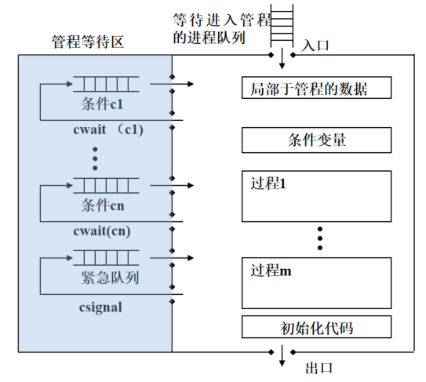

---

desc: "并发与同步"
tags: "操作系统"
outline: deep
---

# 互斥与并发

## 并发的原理

## 🚂读者/写者问题

### 条件
- `同时读`：允许多个读者进程可以同时读数据
- `互斥写`：不允许多个写者进行同时写数据
- `互斥读写`：如果有写者正在写数据，不允许读者进程读数据
  
### 解决策略
- 读者优先
- 写者优先
- 公平优先


**读者优先**
::: tip 规则
- 一旦有读者正在读数据，允许随后的读者进入读数据
- 只有当全部读者退出，才允许写者进入写数据
- 容易导致<WarnBlock>写者饥饿</warnBlock>

:::
``` c {1-3,12,17}
 wsem :互斥信号量,用于Writers和Readers 互斥
 readcount :统计同时读数据的Readers 个数
 mutex :对变量readcount 互斥算术操作
// 信号量定义
semaphore wsem=1;
semaphore mutes=1;
int readcount=0;
reader: 
   while(true){
        p(mutex);
        readcount++;
        if(readcount==1) p(wsem); //🔒.只有第一个读者，
        v(mutex);
        读数据
        p(mutex);
        readcount--;
        if(readcount==0) v(wsem); //🔓.直到最后一个读者
        v(mutex);
    }
writer：
    while(true){
        p(wsem);
        写数据
        v(wsem);
    }
```
**公平优先**
::: tip 规则
- 读、写过程中，若其他读者、写者到来，则按到达顺序处理
:::

``` c {1-4,10,15}
wsem :互斥信号量，用于用于Writers和Readers 互斥
readcount 统计同时读数据的Readers个数
mrc 对变量readcount 进行互斥
wrsem 互斥信号量，确定Writer、Reader请求顺序
// 信号量定义
semaphore wsem=1,mrc=1,wrsem=1;
int readcount=0;
reader: 
    while(true){
        p(wrsem); // 🔒.确保顺序
        p(mrc);
        readcount++;
        if(readcount==1) p(wsem);
        v(mrc);
        v(wrsem);   //🔓
        读数据
        p(mrc);
        readcount--;
        if(readcount==0) v(wsem);
        v(mrc);
            
    }
writer:
    while(true){
        p(wrsem);
        p(wsem);
        写数据
        v(wsem);
        v(wrsem);
    }

```

**写者优先**
::: tip
- 当一个写者准备写数据时，不允许<warnBlock>新</warnBlock>的写者进入写数据
- 当一个新进程声明想写时，不允许新的读进程访问数据区
- <warnBlock>解决了写者饥饿问题，但是降低了系统的并发程度</warnBlock>
  
  <small>它限制了新的读请求的处理，在等待一个正在进行的或即将进行的写操作期间可能会浪费大量资源</small>
:::
``` c {1-2}
rsem 至少有一个写者在申请写数据时互斥新的读者进入读数据
writecount 用于控制rsem 信号量
mwc 对变量writecount 互斥算术操作
//信号量定义
semaphore wsem=1,rsem=1,mrc=1,mwc=1
int readcount=0,writecount=0
reader:
    while(true){
        p(rsem);
        p(mrc);
        readcount++;
        if(readcount==1) p(wsem);
        v(mrc);
        v(rsem);
        
        读数据
      
        p(mrc);
        readcount--;
        if(readcount==0) v(wsem);
        v(mrc);
    }
writer: 
    while(true){
        p(mwc)
        writecount++;
        if(writecount==1) p(rsem); //🔒.第一个写者执行
        v(mwc);

        p(wsem);
        写数据
        v(wsem);

        p(mwc);
        writecount--;
        if(writecount==0) v(rsem); // 🔓. 最后一个写者执行
        v(mwc);   
    }

```
**`z`信号量**
::: tip 规则
 只允许一个读进程在`resm`上面排队，其他读进程在`z`上面排队。防止`write starvation`
:::
``` c {3,10}
void reader( ) {
   while (true) {
     P(z);
      P(rsem);
       P(mrc);
        readcount++;
        if (readcount ==1) P(wsem);
       V(mrc);
      V(rsem)；
     V(z);
     READ;
     P(mrc);
      readcount--;
      if (readcount ==0) V(wsem);
     V(mrc);
   }
 }

```
### 例题
>   有一座东西方向的独木桥，每次只能有一人通过，且不允许行人在桥上停留。东、西两端各有若干行人在等待过桥。请用P、V操作来实现东西两端行人过桥问题。
``` c
semaphore mutex=1; //只允许一个人在桥上
void reader(){
    while(true){
        p(mutex);
        过桥;
        v(mutex);
    }
}
void writer(){
    while(true){
        p(mutex);
        过桥;
        v(mutex);
    }
}

```
>有一座东西方向的独木桥，同一方向的行人可连续过桥。当某一方向有行人过桥时，另一方向行人必须等待。桥上没有行人过桥时，任何一端的行人均可上桥。请用P、V操作来实现东西两端人过桥问题

<warnBlock>错误代码:</warnBlock>
只满足一边人在上桥时具有连续上桥的功能，另一边则会被插队
``` c
semaphore wsem=1;
semaphore mrc=1;
int readcount =0;
void reader(){
    while(true){
        p(mrc);
        readcout++;
        if(readcount==1) p(wsem);
        v(mrc);
        过桥
        p(mrc);
        readcount--;
        if(readcount=0) v(wsem);
        v(mrc);
    }
void  writer(){
    while(true){
        p(wsem);
        过桥;
        v(wsem);
    }
}
}
```
<trueBlock>正确代码：</trueBlock>
角色动态变化
``` c
int countA=0,countB=0;
semaphore mutex=1,mutexA=1,mutexB=1;
void east_west(){
    while(true){
        p(mutexA);
        countA++;
        if(countA==1) p(mutex);
        v(mutexA);
        walktrough
        p(mutexA);
        countA--;
        if(countA==0) v(mutex);
        v(mutexA);
    }
}
void west_east(){
    while(true){
        p(mutexB);
        countB++;
        if(countB==1) p(mutex);
        v(mutexB);
        walktrough
        p(mutexB);
        countB--;
        if(countB==0) v(mutex);
        v(mutexB);
    }
}
```
>   有一座东西方向的独木桥，同一方向的行人可连续过桥。当某一方向有行人过桥时，另一方向行人必须等待。桥上没有行人过桥时，任何一端的行人均可上桥。出于安全考虑，独木桥的最大承重为4人，即同时位于桥上的行人数目不能超过4。请用P、V操作来实现东西两端人过桥问题

``` c {1,12,14}
capicity 用来表示桥上是否可以继续上人
semaphore mutexA=1,mutexB=1,mutex=1,capicity=4;
int countA=0,countB=0;
void east-west(){
    while(true){
        
        p(mutex)
        countA++;
        if(countA==1) p(mutex);
        v(mutex);

        p(capicity)  //判断是否可以继续上桥
        walkTrough
        v(capicity);

        p(mutex)
        coutA--;
        if(countA==0) v(mutex);
        v(mutex);
        
    }
}
```
**理发师睡觉问题**
>理发店有1位理发师、1把理发椅和5把供等候理发的顾客坐的椅子。如果没有顾客，则理发师睡觉。当一个顾客到来时，他必须叫醒理发师。如果理发师正在理发时又有顾客到来，则如果有空椅子可坐，他就坐下来等。如果没有空椅子，他就离开
::: tip 变量
- waiting 正在等的人数
- finish 理发师是否完成理发
- ready   理发师是否可以开始理发
- wchair  等待椅子信号量
- bchair 理发师椅子信号量
- mutex 变量waiting 互斥信号量
:::

``` c
int waiting=0;
semaphore finish=0,ready=0,wchair=5，bchair=1,mutex=1;
void coustomer(){
    p(mutex);
    if(waiting>=6){   
        waiting++;
        v(mutex);
        p(wchair);
        p(bchair);
        v(wchair);
        v(ready);
        p(finish);
        v(bchair);
        p(mutex);
        waiting--;
        v(mutex);
    }else {
        离开;
        v(mutex);
    }
}
void baber(){
    休息;
    p(ready);
    理发;
    v(finish);
}
int main(){

}
```

::: danger 注意
`读者和写者问题` :数据可多次读

`生产者与消费者问题` :数据消费后就没有了

:::


## 🛳️管程

### 管程的概念
::: tip 定义
- `共享数据结构`:对系统中共享资源的抽象
- `操作`:可以同步进程和改变管程中的数据
- `过程`:对`共享数据结构`的`操作` ,通过调用这些过程实现对共享资源的申请、释放和其他操作
:::

### 管程的特点
::: tip 特点
- 局部数据变量只能被管程中的过程访问，任何外部的过程都不可以访问
- 一个进程通过调用管程的一个过程进入管程
- 在任何时候，只有一个进程正在管程执行，调用管程的任何其他进程都被阻塞，以等待管程可用
:::

### 管程实现
**函数**

`cwait(c)`：调用进程执行在条件c上堵塞，管程可供其他进程使用
`csignal(c)`：恢复在条件c上阻塞的一个进程，若不存在阻塞进程，则什么也不做

**管程结构**



### 管程解决生产者/消费者问题
```c
moitor boundedbuffer;
char buffer[N];
int nextin=0,nextout=0;
int count=0;
cond notfull,notempty;

void append(char x){
    if(count==N) cwait(notfull);
    buffer[nextin]=x;
    nextin=(nextin+1)%N;
    count++;
    csignal(notempty);
}
void take(char x){
    if(count==0) cwait(notempty);
    x=buffer[nextout];
    nextout=(nextout+1)%N;
    count--;
    csignal(notfull);
}

void producer(){
    char x;
    while(true){
        produce(x);
        append(x);
    }
}
void consumer(){
    char x;
    while(true){
        take(x);
        consume(x);
    }
}


```
::: danger 注意
如果由于某种原因，一个管程中执行的进程必须阻塞，则该进程必须释放管程，供其他进程使用
:::

## 🤼‍♀️消息传递
### 功能
`同步`:可以保证互斥

`通信`：交换信息

### 实现
**通信原语**
``` c
send(destination,message)
//进程以消息的形式给指定的进程（目标）发送信息

Receive(source,message)
//进程通过接收原语receive接收消息，接收原语中指明源进程和消息

```
**寻址方式**
::: warning 方式
直接寻址：

`send`:
原语包含目标进程的标识号

`receive`:
1. 显式的指明源进程:对于处理并发进程的合作有效
2. 不可能指定源进程:如打印机服务进程，采用隐式寻址，接收到消息时将源地址保存下来

间接寻址：
消息被发送到一个共享的数据结构，该结构由暂存消息的队列构成。发送进程往信箱发送消息，接收进程从信箱取走消息


:::
**消息传递的三种方式**
- 阻塞发送，阻塞接收
  
- 不阻塞发送，阻塞接收（最有效的一种组合）
  
   发送者不阻塞，但是接收者阻塞直到请求的消息到达

- 不阻塞发送，不阻塞接收
  
  不要求任何一方等待

**消息格式**
- 消息类型
- 目的进程标识符
- 源进程标识符
- 消息长度
- 控制消息
- 消息内容

### 消息传递实现互斥
1. 多个并发执行的发送进程和接收进程共享一个邮箱`box`,`box`的初始状态为仅包含一条“空消息”
2. 采用“不阻塞发送，阻塞接收”方式传递消息
3. 若邮箱中存在一条消息，则允许一个进程进入临界区
4. 若邮箱为空，则表明有一个进程位于临界区，其它试图进入临界区的进程必须阻塞

``` c
void P(int i){
    message msg;
    while(true){
        receive(box,msg);
        <临界区>
        send(box,msg);
    }
}
int main(){
    create_mailbox(box);
    send(box,null);
    parbegin(P(1),P(2),……,P(n));
}
```

### 消息传递实现生产者/消费者问题
- 邮箱`Mayproduce`:该邮箱起初填满空消息（即允许生产的令牌）,只要该邮箱有消息，生产者就可生产
- 邮箱`Mayconsume`:生产者产生的数据作为消息发送到该信箱（即允许消费的令牌）,只要该邮箱有数据消息，消费者就可消费

``` c
void producer(){
    message pmsg;
    while(true){
        receive(mayproduce,pmsg);
        pmsg=produce();
        send(mayconsume,pmsg);
    }
}
void consumer(){
    message cmsg;
    while(true){
        receive(mayconsume,cmsg);
        consume(smsg);
        send(mayproduce,null);
    }
}
void main()
{
    create_mailbox(mayproduce); 
    create_mailbox(mayconsume);
    for (int i = 1; i <= capacity; i++) send(mayproduce, null); //初始化信箱     
    parbegin(producer, consumer);
}

```