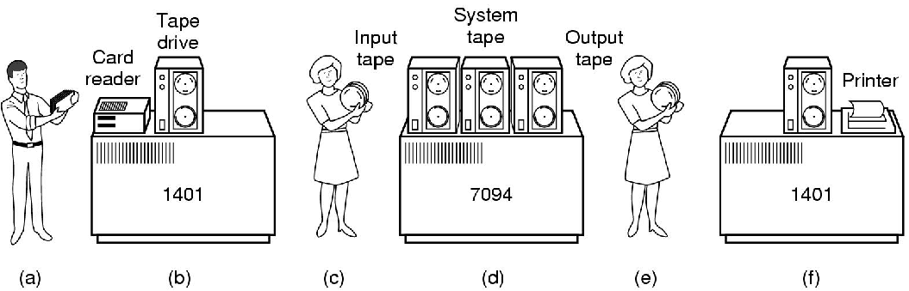
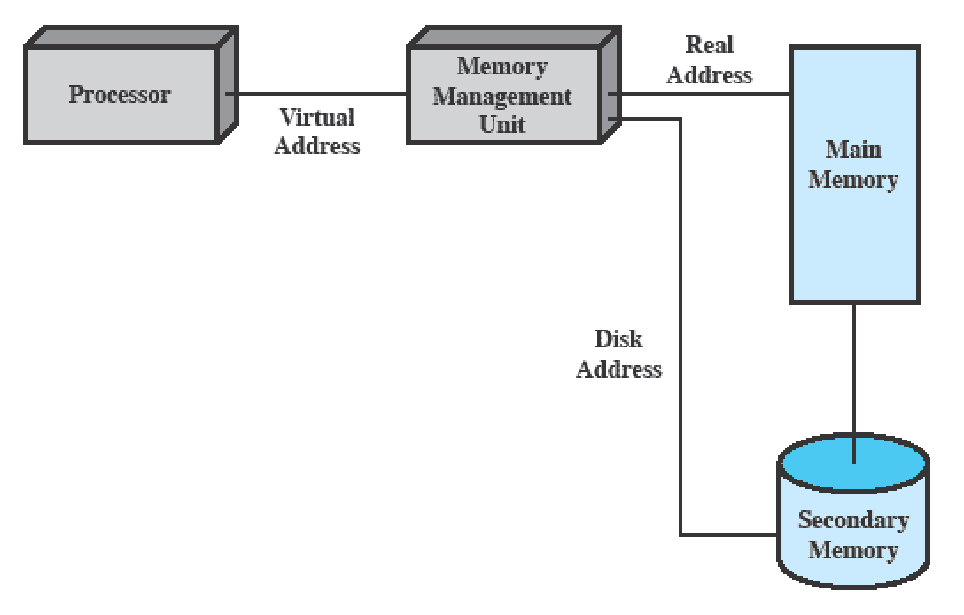

---

desc: "操作系统概述"
tags: "操作系统"
outline: deep
---
# 概述

## 🧉操作系统目标与功能

### 功能
- 控制应用程序执行的`程序`
- 应用程序和计算机硬件间的`接口`
  

### 目标
- `方便`：使计算机更易于使用
- `有效`：允许更有效的方式使用计算机系统资源
- `拓展能力`：在不妨碍服务的前提下，有效的开发、测试和引入新的系统功能

**作为用户/计算机接口的操作系统**
- `程序开发`：如编辑器和调试器
- `程序运行`：如加载到内存、初始化I/O设备
- `I/O设备访问`：影藏具体的I/O操作指令
- `文件访问控制`：屏蔽存储介质的细节
- `系统访问`：提供接口，防止未授权访问行为
- `错误检测和响应`：软、硬件错误
- `记账`：收集资源的利用率信息、监控性能特性

**作为资源管理器的操作系统**
- `资源管理者`：计算机是一组资源，用于移动、存储和处理数据；OS负责管理这些资源，控制数据的移动、存储和管理
- `控制机制的特殊性`：OS 会经常释放控制，且必须依赖处理器才可以恢复
::: tip 资源管理
1. 内存的分配管理
2. I/O的访问控制
3. 对文件的访问控制和使用
4. 对处理器的分配
:::

**操作系统的易拓展性**

重要的操作系统需要不断地发展：
1. 硬件升级和新型硬件的不断出现
2. 新的服务
3. 纠正错误
   
## 🍄操作系统的发展史
### 串行处理
**处理机制**
- <warnBlock>没有操作系统</warnBlock>
- 程序员通过操作控制台运行程序，控制台包括显示灯、触发器、某种类型的输入设备和打印机
- 程序通过输入设备（卡片阅读器）载入计算机
- 用户按照`顺序`访问计算机

**出现的一些问题**
- `调度`：使用硬拷贝登记来预定机器时间；用户在使用机器之前对时间进行估计，往往估计不准确，导致任务没有完成或机器闲置
- `准备时间`：单个作业可能会向内存加载编译器和高级语言程序，保存编译好的程序，然后加载目标程序和公用函数进行链接。每个步骤都会安装或拆卸磁盘，一旦出现错误就得重新开始

### 简单批处理系统

**处理机制**
- 对一批作用进行自动处理
- 内存中只可以存放一道作业

**监控程序**
- 作业的`自动`续接
- `内存保护`：保护监控程序所在的内存空间
- `定时器`：防止某作业独占系统
- `特权指令`：只能由监控程序执行的指令
- `中断`：早期的计算机模型没有这个能力

**运行模式**
- 用户模式：不允许执行特权指令
- 内核模式：可以执行特权指令以及访问受保护的内存区域
  
**特征**
1. `自动性`
2. `顺序性`
3. `单道性`

### 多道批处理系统

**改进**
- 内存中可以同时存放多个作业
- 多个作业可以并发执行
- 作业调度程序负责作业的调度

**硬件支持**
- 中断
- `DMA`:Direct Memory Access ,硬件设备能够直接访问物理内存无需通过操作系统进行调度与处理
  
**特征**
- 多道性
- 调度性
- 无序性
- 无交互能力

### 分时系统

**机制**
- 采用多道程序设计技术处理多个交互作业
- 多个用户共享一个处理器
- 多个用户通过不同的终端同时访问系统
  
**特征**
- 多路性
- 独立性
- 及时性
- 交互性
  
**实例**

第一个分时处理系统 `CTSS`

|               | 多批道处理器系统 | 分时系统  |
| ------------- |:-------------: | -----:|
| 主要目标       | 充分使用处理器  | 减少响应时间 |
| 操作系统指令源      | 作业控制语言命令   作业提供的命令      |   终端键入的命令 |

### 实时系统

**概念**

 系统可以`及时`响应外部事件的请求，在规定的时间内完成对该事件的处理，并控制所有实时任务协调一致的运行

**特征**
- `可确定性`：当外部事件发生时，系统必须能够在预定时间内完成任务并产生结果
- `可响应性`
- `用户控制`
- `可靠性`：具有高度可靠性，并且不能出现失败或错误
- `故障弱化能力`：当硬件或软件组件发生故障时，实时系统应该能够继续运行，并尽可能减少失败的影响。这可以通过冗余设计、错误检测和恢复机制等方式来实现

## 🥗操作系统的主要成就

### 进程

**概念**
- 一个正在执行的程序
- 计算机正在运行程序的一个实例
- 可以分配给处理器并由处理器执行的一个实体

**组成**
- 一组可执行的程序
- 程序所需要的相关数据（变量、工作空间、缓冲区）
- 程序执行的上下文
::: tip 进程状态（上下文）
1. 进程状态
2. 操作系统用来管理和控制进程所需的所以数据
   - 处理器寄存器的内容
   - 进程的优先级
   - 是否在等待I/O 事件
   - 在内存中的位置
:::

### 内存管理

**任务**
- `进程隔离`：每个进程拥有独立的地址空间，互不干扰
- `自动分配和管理`：动态分配，对程序员透明
- `支持模块化程序设计`：程序员可以定义程序模块，并动态的加载、销毁定义的模块
- `保护和访问控制`：一个应用程序不能任意的访问其他程序的存储空间
- `长期存储`：关机后仍可以长时间存储信息

**实现**

::: warning 虚拟内存
- 以`逻辑方式`访问存储器，不考虑物理内存空间数量
- 满足`多作业`同时驻留内存的要求
- 换入、换出机制
- 每个进程大小不同——分页机制
- 每个作业`部分`驻留——硬件检测到缺页时，安排载入
:::
寻址方式

分页机制

1. 进程由若干个`固定大小`的块组成——页
2. 虚地址=页号+页内偏移量
3. 进程中的每一页可以存在于内存中的任何位置
4. 提供了虚拟地址和内存实地址之间的动态映射 

### 信息保护和安全

**典型问题**
- `可用性`：保护系统不被中断
- `机密性`：保证用户不能读取未授权的数据
- `完整性`：保护数据不被授权修改
- `认证`：涉及用户身份的正确认证和消息或数据的合法性

### 调度和资源管理

**关键任务**
管理各种可用资源，并调度进程来使用这些资源

**需要考虑的问题**
- `公平性`：所有竞争同类资源的进程享有同等和公平的资源访问机会
- `有差别的响应性`：区别进程类型且可动态调整
- `有效性`：
  
   1. 操作系统希望获得最大的吞吐量和最小的响应时间
   2. 能够容纳尽可能多的用户
   3. 折中处理矛盾需求

## 🍠现代操作系统的特征

### 微内核

**特征**

只给内核分配一些基本的功能——进程间的通信、基本的调度

**优点**
1. `简化了实现`：微内核只包含最基础和关键的部分,降低了操作系统开发和维护的复杂性
2. `提供了灵活性`：非必须运行在特权模式下的服务或者组件被移出到用户空间，并作为独立进程来实现
3. `适合于分布式环境`：微内核通过进程间通信（IPC）机制实现各个组件之间的交互，在分布式环境下也需要类似机制进行跨节点通信
::: danger 单体内核VS微内核
`单体内核`：一个大的内核，提供操作系统的大多数功能，包括调度、文件系统、网络、设备驱动器、存储管理等。典型情况下，单体内核作为一个单独的进程来实现，所有元素共享相同的地址空间。内核的所有功能组件可以访问内核所有的数据结构和方法。

`微内核`：只给内核分配基本的功能，包括进程调度、存储管理、进程间通信等，其他操作系统服务由运行在用户模式且与其他应用程序类似的进程提供。
:::
### 多线程

**特征**

把执行的一个应用程序的进程划分为可以同时运行的多个线程

**线程**
1. 可分配的工作单元
2. 包括处理器的上下文环境、自身的数据区域
3. 顺序执行且可以中断（转到其他线程）

### 对称多处理（SMP）

**特征**
- 多个进程或线程可以`并行`运行 <trueBlock>真正的并发</trueBlock>
- 多个处理器对用户来说是透明的
- 操作系统在不同的处理器上调度不同的进程或线程，并负责他们之间的同步

**优点**
- `性能`：允许多个处理器同时执行不同的任务
- `可用性`：如果一个处理器发生故障，其他处理器通常还能继续运行。这就提高了系统的容错能力和可用性
- `增量增长`：添加新的CPU进入已存在系统中进行工作
- `可拓展性`

### 分布式操作系统

**目标**
1. 单一的内存空间
2. 单一的外存空间
3. 统一的存取措施

### 面向对象的设计

- 用于给小内核增加模块化的拓展
- 程序员容易定制操作系统，而不会破坏代码的完整性
- 使分布式工具和分布式操作系统开发变得容易

## 🍅容错性

### 概念
系统或部件发生软/硬件错误时，能够继续正常运行的能力

### 相关技术
- `进程隔离`：进程的内存、文件存取和执行过程相互隔离
- `并发控制`：采用并发控制保证进程通信或协作时的正确性
- `虚拟机`：提供更高程度的应用隔离和错误隔离
- `检测点和回滚机制`：检测点事先前程序状态的一个副本，回滚从检测点重新开始执行

## 多处理器和多核操作系统设计

### 关键问题
- 并发进程或线程
- 调度
- 同步
- 内存管理
- 可靠性与容错性

### 并行的三个层次
1. 每个核内部的硬件并行，即指令级并行  <trueBlock>进程中的线程</trueBlock>
2. 每个处理器上潜在的多道程序或多线程程序的执行能力   <trueBlock>进程</trueBlock>
3. 一个应用程序在多核上以多进程或多线程形式执行潜在的并行能力

## 🥯主流操作系统简介

### Windows

**内核模式组件**
- `执行体`：包含操作系统的核心服务，内存管理、进程和线程管理、安全、I/O和进程间的通信
- `内核`：控制处理器的执行，进程切换、中断处理
- `硬件抽象层`：在通用的硬件命令与响应和专门针对某平台的专用命令与响应之间的映射
- `设备驱动`：拓展执行的动态库
- `窗口和图形系统`：实现GUI函数
  
**用户模式进程**
- 特殊服务进程：管理系统所需要的用户模式服务
- 服务进程：后台打印程序、事件记录器、与设备驱动协作的用户模式构件、不同的网络服务程序
- 环境子模式：提供不同的操作系统个性化设置
- 用户应用程序：为充分利用系统功能而为用户提供的可执行程序和动态链接库

**客户-服务器模型**

**优点**
1. `简化了执行体`：可以在用户模式的服务器中构建各种API,不会发生冲突
2. `提高了可靠性`：每个新服务运行在内核之外，有自己的存储空间
3. `为应用程序与服务间通过RPC调用提供了一致的方法`
4. `为分布式计算提供了适当的基础`

**线程和SMP**
- Windows支持线程和对称多处理(SMP)
- 操作系统例程可以运行在任何可用的处理器上，不同例程可同时运行
- 支持在单个进程中执行多线程，不同线程可同时运行在不同处理器上
- 服务器可以使用多线程同时处理多个用户请求
- 提供进程间共享数据和资源的机制和通信能力

**Windows对象**
- 封装
- 对象类和实例
- 继承
- 多态性
