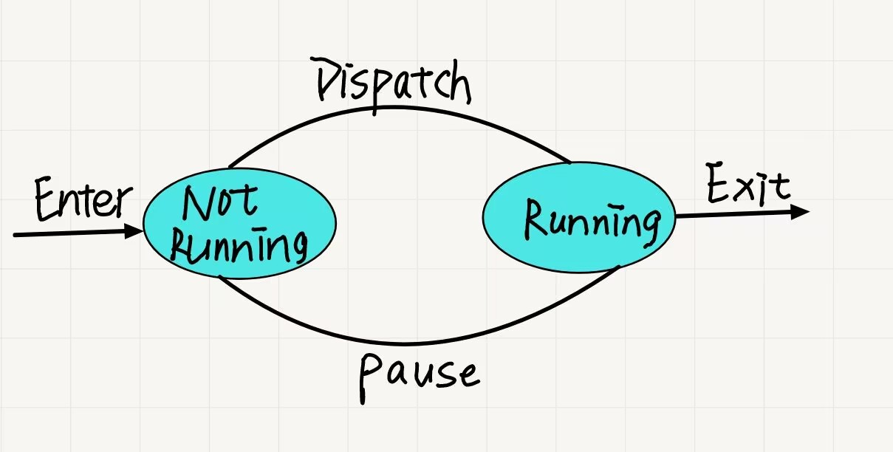
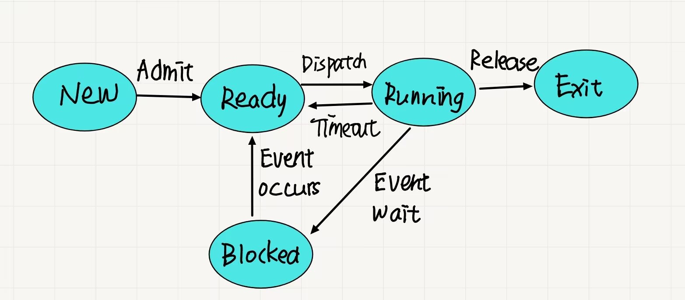
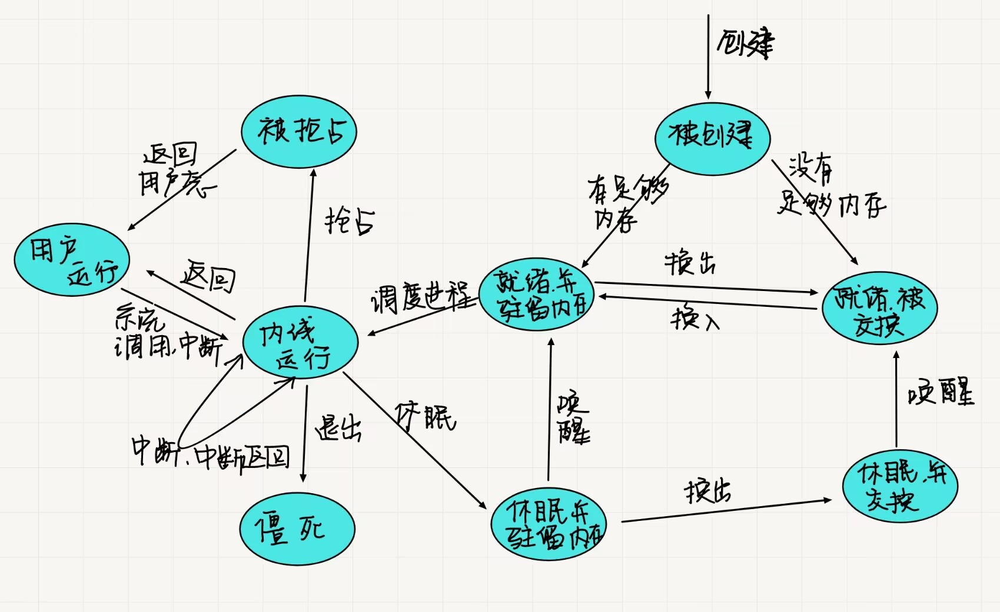

# 进程描述和控制

## 👹进程

### 基本元素
1. 程序代码
2. 与代码相关的一组数据

### 进程控制块
::: tip Process Control Block
由操作系统创建和管理，包含进程的元素；在进程执行的基本过程中，可以中断进程的执行，并在后来恢复进程执行，就好像中断没有发生过一样

包含：
1. `标识符`：与进程相关的唯一标识符，用来区分其他的进程
2. `状态`：若进程正在执行，则进程处于运行态
3. `优先级`：相较于其他进程的优先顺序
4. `程序计数器`：程序中即将执行的下一条指令的地址
5. `内存指针`：包括程序代码和进程相关信息的指针，以及与其他进程共享内存块的指针
6. `上下文数据`：进程执行时处理器的寄存器中的数据
7. `I/O状态信息`：包括显式I/O请求、分配给进程的I/O设备和被进程使用的文件列表
8. `记账信息`：包括处理器时间总和、使用的时钟数总和、时间戳、记账号
:::


## 👻进程状态

### 进程的轨迹
**轨迹**

进程执行的指令序列，用来描述单个进程的行为；处理器的行为可以使用多个进程交替执行的轨迹来描述

**分派器**

将处理器从一个进程切换到另一个进程的小程序

### 进程的两状态模型
在任何时刻，一个进程要么正在执行，要么未执行，构建下面最为简单的两状态模型

### 进程的创建与终止
**创建**

将一个新进程添加到正被管理的进程集时，操作系统需要建立用于管理该进程的数据结构，并在内存中为它分配地址空间，这些行为构成了一个新进程的创建过程

**创建的一些场景**
|     事件          | 说明 | 
| ------------- |:-------------: | 
|新的批处理作业    | 批处理提交作业，处理新的作业时，操作系统读取下一个作业控制指令  | 
|交互登录       | 终端用户登录系统      |   
|为提供服务而由操作系统创建|操作系统为给用户提供服务而创建进程，如控制打印进程 |
|由现有进程派生（操作系统显示请求创建一个进程）|用户程序可以创建多个进程（模块化开发或并行性考虑）|

**终止**

任何一个计算机系统都必须为进程提供表示其完成的方法

**终止的一些场景**
|     事件          | 说明 | 
| ------------- |:-------------: | 
|正常完成    | 进程自行执行操作系统服务调用，表示它已经结束  | 
|运行超过时限       | 运行时间超过规定的时限     |   
|无可用内存|系统无法满足进程需要的内存空间 |
|超出范围|进程试图访问不允许访问的内存单元|
|保护错误|进程试图使用不允许使用的资源或文件，或不允许的访问方式|
|算术错误|进程试图执行被禁止的运算|
| 等待时间超出|等待某事件发生的时间超出规定最大值|
|I/O失效|在输入或输出期间发生错误，如找不到文件，读写失败|
|无效指令|进程试图执行不存在的指令|
|特权指令|进程试图使用为操作系统保存的指令|
|数据误用|使用错误类型或未初始化的一块数据|
|操作员或操作系统干涉|操作员或操作系统终止进程(如死锁时)|
|父进程终止|父进程终止时，操作系统可能会终止该进程的所有子进程|
|父进程请求|父进程具有终止其任何子进程的权力|

### 五状态模型


`运行态`：程序正在进行

`就绪态`：进程做好了准备，只要有机会就开始执行

`阻塞/等待态`：进程在某些事件发生前不能执行

`新建态`：刚刚创建的进程，操作系统还未把他加入可执行进程组

`退出态`：操作系统从可执行进程组中释放出去的进程

### 进程的排队模型

**单阻塞队列**

所有的阻塞进程位于一个阻塞队列
::: danger 问题
当一个事件发生之后，操作系统必须扫描整个阻塞队列，收索哪些等待该事件的进程；但是在大型操作系统当中，队列中可能有几百个甚至几千个进程，很难有效分类管理和优化策略制定
:::

**多阻塞队列**

不同的事件对应不同的阻塞队列
当然我们在这个问题的讨论之上，也可以考虑建立多个就绪队列，提高作业的效率

### 挂起的进程

**交换**

把内存中一个进程的部分或全部移到磁盘中
- 当内存紧张或内存中没有就绪进程时，操作系统将一个阻塞进程换出到磁盘中的挂起队列
- 操作系统要么从挂起队列中取回一个进程，要不接纳一个新进程进入内存

**挂起状态**

进程被交换到外存
- 将内存中处于阻塞、就就绪、甚至是执行状态的进程放到外存，不在参与CPU的竞争


模型中添加一个挂起的状态，表示将内存中的阻塞状态的进程加载到外存

::: danger 出现的问题
如果挂起进程等待的事件没有发生，把挂起进程取回内存是没有意义的
:::

进行改进

.jpg)

**挂起状态特点**
- 进程不可以被立即执行
- 进程可能在等待一个事件，也可能没有
- 为了防止进程执行，进程被一个代理设置成挂起状态，这个代理可能为进程自己、父进程或操作系统
- 除非代理显示的命令进程状态转换，否则进程的挂起状态不会变化

**进程挂起的原因**
|     事件          | 说明 | 
| ------------- |:-------------: | 
|交换    | 操作系统需要释放足够内存空间，调入并执行处于就绪状态的进程  | 
|其他OS原因       | 操作系统可能挂起后台进程或工具程序进程，或挂起可能会导致问题的进程     |   
|交互式用户请求|用户希望挂起一个程序的执行，以便进行调试或管理资源的使用 |
|定时|周期性执行进程在等待下一个时间间隔时被挂起|
|父进程请求|父进程请求挂起后代进程|

## 👾进程描述
要控制进程并管理资源，操作系统需要哪些信息

### 操作系统的控制结构
操作系统采用表格（或数据结构）来记载各资源的信息，从而实现对资源的管理、维护、更新
- 内存表
- I/O表
- 文件表
- 进程表

**内存表**

用于跟踪内（实）存和外（虚）存。内存中的某些部分操作系统保留，剩余部分供进程使用，外存中保存的进程使用某种虚存或简单的交换机制

包含的信息
- 分配给进程的内存
- 分配给进程的外存
- 内存块或虚拟块的任何保护属性，哪些进程可以访问某些共享内存区域
- 管理虚存所需要的任何信息
  

**I/O表**

当进程中有I/O 操作时，操作系统必须知道：I/O操作的状态；作为I/O传输数据的源或目标的内存单元


**文件表**

提供的信息
- 文件是否存在
- 文件在外存中的位置
- 当前的状态
- 其他属性

**进程表**
- 用来管理进程
- 表中有对内存、I/O设备和文件的直接或间接引用
- 表本身必须能够被操作系统所访问，因此它们受制于内存管理

### 进程控制结构

**进程位置**

首先，我们需要考虑的就是进程的物理地址是什么？一个进程最少必须包括一个或一组被执行的程序，需要有足够的内存空间来保存其相关程序和数据，同时涉及用于跟踪过程调用和过程间参数传递的栈

**进程映象**

程序、数据、栈和属性的集合
|     项目         | 说明 | 
| ------------- |:-------------: | 
|用户数据    | 用户空间中的可修改部分，包括程序数据、用户栈区域和可修改的程序  | 
|用户程序       | 待执行的程序     |   
|交互式用户请求|用户希望挂起一个程序的执行，以便进行调试或管理资源的使用 |
|栈|每个进程有一个或多个后进先出（LIFO）栈，栈用户保存参数、过程调用和系统调用地址|
|进程控制块|操作系统控制进程所需的数据|

**进程控制块**

- 进程标识信息
- 处理器状态信息
- 进程控制信息

::: tip 分类
1. `进程标识信息`

存储在进程控制块中的数字标识符

   - 该进程的标识符（Process ID，简称进程ID）
   - 创建该进程（父进程）的标识符
   - 用户标识符（User ID）

2. `处理器状态信息`:
所有的处理器都包含有程序状态字寄存器（`Program status word`）:通常包含有条件码和其他状态信息

    - 用户可见寄存器：在用户模式下执行机器语言时可以访问的寄存器。通常有8~32个此类寄存器
    - 控制和状态寄存器：
      - 程序计数器：包含下一条待取指令的地址
      - 条件码：最近算术运算或逻辑运算的结果（符号、零、进位、等于、溢出）
      - 状态信息：包括中断允许/禁用中断、执行模式
    - 栈指针：每个进程有一个或多个与之相关联的后进先出（LIFO）系统栈。栈用于保存参数和过程调用或系统调用的地址，栈指针指向栈顶
3. `进程控制信息`
   
操作系统控制和协调各种活动进程所需的额外信息
   - 调度和状态信息：操作系统执行调度的功能所需的信息
     - 进程状态：定义待调度执行的进程的准备情况（就绪态、运行态、停止态）
     - 优先级：描述进程调度优先级的一个或多个域
     - 调度的相关信息：具体取决于所用的调度算法（不同类型的调度算法可能需要额外保存各自所需内容），如进程等待的时间总量和进程上次运行的执行时间的总量
     - 事件：进程在继续执行前等待的事件标识 （事件如 I/O 完成、信号量变动、其他线程完成工作等情况而暂停运行时）
   - 数据结构：进程可以以队列、环或其他的结构链接到其他的进程；需要有数据结构支持这样的连接
   - 进程间的通信：各种标记、信号和信息可与两个无关的进程间的通信关联，进程控制块可以维护某些或全部此类的信息
   - 进程特权：进程根据其可以访问的内存和可执行的指令类型来赋予特权
   - 存储管理：该部分包括指向描述分配给该进程的虚存的段表或页表的指针
   - 资源所有权和使用情况：指示控制进程的资源

:::

**进程控制块的作用**

进程控制块是操作系统中最重要的数据结构，每个进程控制块都包含操作系统的所需进程的所有的信息

## 🤖进程控制

### 内核

**概念**

- 操作系统中包含重要系统功能的部分
- 常驻内存，便于提高操作系统运行效能

**功能**
::: tip 功能
1. 资源管理系统
   1. 进程管理
     - 进程创建和终止
     - 进程的调度和分派
     - 进程切换
     - 进程同步和进程间通信的支持
     - 管理进程控制块
   2. 存储管理
     - 为进程分配地址空间
     - 交换
     - 页和段管理
   3. I/O设备管理
     - I/O缓冲区的管理
     - 为进程分配I/O通道和设备
2. 支持功能
   1. 中断处理：内核的基础功能，也是整个操作系统赖以活动的基础，操作系统的一切重要活动最终都依赖于中断
   2. 时钟管理：操作系统的很多功能都依赖于时钟，时间分片技术
   3. 记账（统计、监测）功能
:::

### 执行模式

**用户模式**

- 拥有较少特权的模式
- 用户程序在该模式下运行

**系统模式（内核模式/控制模式）**
- 与操作系统相关的处理器模式，具有更多的优先权
- 运行操作系统的内核
- 某些指令只能够在特权模式下运行
  - 读取和修改程序状态字之类的控制器的指令
  - 原始的I/O指令
  - 与内存管理相关的指令
- 部分内存只能在特权模式下访问


::: warning  处理机如何知道它在什么模式下执行？

典型的情况下，当用户调用一个操作系统服务或中断触发系统例程的执行的时，执行模式会被置为内核模式；当从系统服务返回到用户程序的时候，执行模式则置为用户模式。

例子：`IA-64`体系架构下的`Intel Itanium`处理器中，有一个2位`CPL`(Current Privilege Level,当前特权级别)字段的处理器状态寄存器(`PSR`)。级别0是最高特权级别，级别3是最低特权级别

:::


### 进程创建

1. 为进程分配一个唯一的进程标识符：主进程表上会添加一个新表项，每一个进程一个表项
2. 为进程分配空间：包括进程映象中的所有数据
3. 初始化进程控制块：进程初始不具有任何资源
4. 建立连接，将之插入就绪或就绪/挂起链表
5. 建立或扩充其他数据结构：操作系统可因编制账单和/或评估性能，为每个进程维护一个记账文件

### 进程切换

**普通中断**

由当前进程运行独立的某种外部事件发生而发生

- 时钟中断：操作系统确定当前运行进程的执行时间是否已经超过最大的允许时间段
- I/O 中断：操作系统确定是否发生I/O操作
- 内存失效：处理器遇到一个引用不在内存的字的虚拟地址

**陷阱**
正在运行的进程产生错误或异常条件有关

出现的错误是否致命？
- 是：当前进程置为退出态，切换进程
- 否：操作系统的动作取决于错误的性质，尝试恢复


**系统调用**
系统显示请求，调用系统函数

::: danger 切换进程的几种情况

|     机制         | 原因 | 用途|
| ------------- |:-------------: | :-------------: | 
|中断    | 来自当前执行命令的外部  | 对异步外部事件的响应|
|陷阱       | 与当前执行指令相关     |   处理一个错误或一个异常条件|
|系统调用|显示请求 |调用操作系统函数|

:::


### 模式切换

用户模式和内核模式之间的相互转换

::: tip 模式切换情形 
1. 没有中断出现：处理器继续取当前进程中的下一条指令
2. 有中断出现：
   - 将程序计数器置为中断处理程序的开始地址
   - 切换模式，一边中断处理能执行特权指令
:::

::: danger 注意
模式切换不一定会导致进程切换（`getpid()`）
:::

**进程状态的改变**
- 模式切换与进程切换不同，模式切换可以在不改变进程运行的状态下进行
- 如果当前运行进程将转化为另一个状态，则操作系统必须使环境产生实质性的变换

::: info 切换的具体步骤
1. 保存处理器的上下文，包括程序计数器和其他计数器
2. 更新当前处于运行态进程的进程控制块，包括把进程的状态改变为另一状态。必须更新其他的相关字段，包括退出运行态的原因和记账信息
3. 把该进程的进程控制块移动到相对于的队列（就绪、阻塞、就绪\挂起状态）
4. 选择另外一个进程开始执行
5. 更新所选进程的进程控制块，包括进程的状态改为运行态
6. 更新内存管理数据结构

:::

## 🤡操作系统的执行

### 无进程的内核

操作系统在所有的进程之外执行，即此时的操作系统为一个单独的内核
<warnBlock>其关键点在于“进程的概念”只适用于用户程序，操作系统代码作为一个在特权模式下工作的独立实体被执行！</warnBlock>

### 用户进程内的操作系统

在用户进程的上下文中国执行所以得操作系统软件

### 基于进程的操作系统

把操作系统作为一组系统进程实现

## 🥸UNIX SVR4的进程管理



::: info UNIX进程状态
|     进程状态        | 原因 |
| ------------- |:-------------: | 
|用户运行   | 在用户模式下运行  | 
|内核运行       | 在内核模式下运行    |   
|就绪，并驻留在内存中 |只有内核调度就立即准备运行 |
|休眠，并驻留在内存中|在某事发生前不能执行，且进程在内存中（一种阻塞态）|
|就绪，被交换|进程以就绪，但交换程序必须把他换入内存后才可以调度继续执行|
|休眠，被交换|程序正在等待一个事件，并被交换到外存中（一种阻塞态）|
|被抢占|进程从内核模式返回到用户模式，但内核抢占了它，并做了进程切换，以调度另一个进程|
|创建|进程刚被创建，还没有做好运行的准备|
|僵死|进程不在存在，但它留下一下其进程可以收集的记录|

:::

### 进程创建

- 进程的创建由内核系统调用`fork()`实现
- 操作系统在内核模式下完成

::: tip 进程创建
1. 在进程中为新进程分配一个空项
2. 为子进程分配一个唯一的进程标识符
3. 复制父进程的进程映象，但共享内存除外(这里指的不是全局变量)
4. 增加父进程所拥有的文件的计数器，反映另一个进程也拥有这些文件夹
5. 将子进程设置为就绪态
6. 将子进程的ID号返回给父进程，将0返回给子进程 
:::

 
::: info  fork()例子

``` c
#include <stdio.h>
#include <unistd.h>
int main()
{
    int i;
    for (i=0;i<3;i++)
        fork();
    printf("hello, world\n");
    return 0;
}

```
最后会打印`hello,world` 8次

:::


## 😶‍🌫️线程

### 线程出现的原因

**进程的两个特性**
1. 拥有资源的独立进程：一个进程包括一个保存进程映像的虚拟地址空间，拥有对资源的控制或所有权
2. 调度/执行的基本单位：一个具有状态和优先级，可被操作系统调度并分派的实体

::: tip 原因
这两个部分是独立的，OS应该能够独立的处理他们，也就是线程的出现
:::

**线程(LWP)的诞生**

为了区分进程两个特点，调度并分派的单位通常称为`线程或轻量级进程（LWP）`，资源所有权的单位通常称为进程

- `多线程`：操作系统在单个进程内支持多个并发路径的能力
- `单线程`：每个进程中只有一个线程在执行（没有考虑线程的概念）

**常见的系统**
- `单进程、单线程`：MS DOS
- `单进程、多线程`：Java运行环境
- `多进程、单线程`：传统UNIX
- `多进程、多线程`：Windows Solaris 现代UNIX


### 线程

**线程包含资源**
1. 执行状态（运行、就绪等）
2. 未执行时保存的线程上下文
3. 执行栈
4. 用于局部变量的静态存储空间
5. 与进程内其他线程共享的内存和资源访问

**线程的优点**

- 创建线程的时间少于创建进程的时间
- 终止线程比终止进程花时间少
- 同一进程内线程切换时间，少于进程切换的时间
- 线程提高了不同执行程序间的通信效率


**主要状态**
- 运行
- 就绪
- 阻塞

**基本操作**
- `派生`：一个线程可以派生出新的进程
- `阻塞`
- `解除阻塞`
- `结束`：一个线程完成后，会释放其寄存器上下文和栈


**线程同步原因**
- 一个进程中的所有线程共享一个地址空间和进程所拥有的进程
- 一个线程对共享资源的修改都将影响同一进程的其他线程的环境

### 线程分类

**用户级线程（ULT）**
- 所有线程管理工作由应用程序完成
- 内核意识不到线程的存在

优点：
1. 调度策略因应用程序不同而不同
2. 可以运行在任何操作系统上
3. 线程切换不需要内核模式特权

缺点：
1. 在典型的系统调用中，许多系统调用都会引起进程堵塞，用户级进程执行系统调用时，不仅阻塞当线程，还将引起同一进程中其他线程阻塞
2. 不可以利用多处理器技术

解决办法：
`jacketing技术`:将一个可能产生阻塞的系统调用转化成一个非阻塞的系统调用，例如：替换直接调用一个系统I/O例程，让线程调用一个应用级的I/O套管例程，用于检测确定I/O设备是否忙，如果忙，该线程进入阻塞态并把控制权传送给另一个线程

`多进程程序`：将应用程序写成多进程程序而不是多线程

**内核级线程（KLT）**
- 线程管理由内核完成
- 应用程序没有线程管理的工作

优点：
1. 内核可以把同一进程内的多个进程调度到多处理器
2. 当一个线程阻塞时，内核可以调度同一进程内的其他进程

缺点：
- 把控制权从一个线程传递到相同进程内的另一个线程时，需要切换到内核模式

**混合方法**
1. 线程的创建在用户空间完成
2. 线程的调度和同步也由应用程序完成
3. 一个应用程序中的多个线程被映射到一些（小于或等于用户级线程数）内核线程上