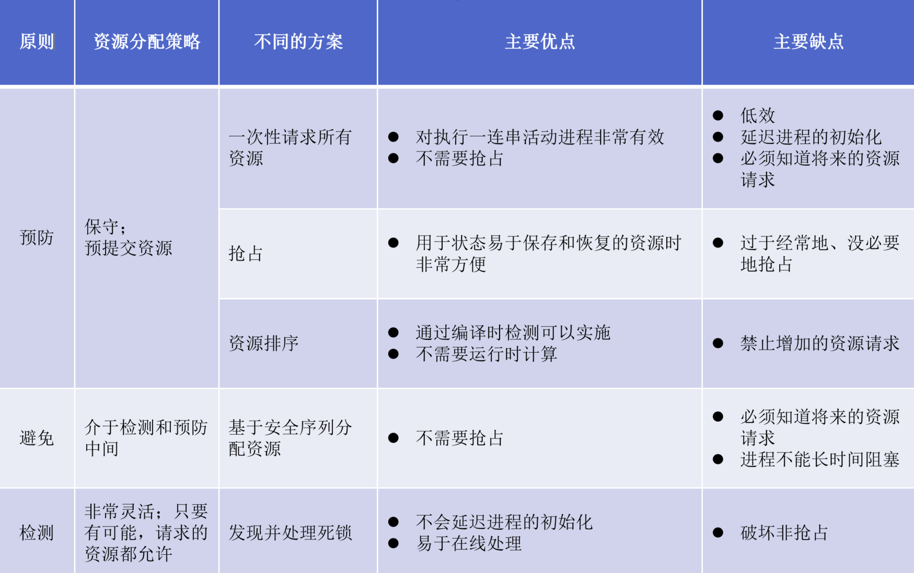

# 死锁

## 👷🏻‍♂️死锁原理

### 死锁

`定义`：一组相互竞争系统资源或进行通信的进程的永久阻塞

**资源分类**

::: info 分类
`可重用资源`：一次仅供一个进程安全使用且不因使用而消尽的资源（如处理器、I/O通道、内存和外存）

`可消耗资源`：可消耗资源是指可被创建（生产）和销毁（消耗）的资源（如中断、信号）

:::

**死锁的条件**
|     必要条件         | 具体含义 | 
| ------------- |:-------------: | 
|互斥    | 一次只有一个进程可以使用一个资源     |
|占用且等待|当进程等待其他资源时，继续占有已经分配的资源  |
|不可抢占| 不可强行抢占进程已经占有的资源|

|     必要条件         | 具体含义 | 
| ------------- |:-------------: | 
|循环等待|存在一个闭合的进程链，每个进程至少占有此链中下一个进程所需的资源|   

**死锁的解决**
1. `死锁预防`：防止死锁产生的条件
2. `死锁避免`：允许三个必要条件，根据当时资源分配状态做出资源分配策略，保证不产生死锁
3. `死锁检测与接触`：不约束资源访问或约束进程的行为，而是检测死锁的存在尝试解除
   
## 👨🏻‍🏭死锁预防

### 间接方法

防止三个必要条件中任意一个条件发生

**互斥**

需要满足对资源互斥访问，互斥必须支持

**防止占有且等待**

要求进程一次性请求所有资源，并阻塞这个进程直到所有资源请求能够满足

::: warning 缺点

1. `低效`：进程可能会阻塞很长时间，分配给进程的资源很长时间内不会被使用
2. 事先不知进程所需的全部资源

:::

**防止不可抢占**

- 一个占有某些资源的进程进一步申请资源时若被拒绝，则释放当初占有的资源（或操作系统要求另一个进程释放资源）
- 只有在资源状态容易保存和恢复情况下，这种方法才实用


### 直接方法

**防止循环等待**

定义一个请求资源的顺序，系统把所有的资源按类型进行线性排队，所有进程对资源的请求必须严格按照资源序号递增的顺序提出

<warnBlock>低效</warnBlock>

## 👨🏻‍🚒死锁避免

- 允许三个必要条件
- 动态检查
  - 在系统运行过程中，检查进程的资源申请，根据检查结果结果决定是否分配资源
- 需要知道预知资源的请求

**资源分配拒绝**

若一个进程增加的资源请求可能会导致死锁，则不允许这一资源分配

**进程启动拒绝**

若一个进程请求可能会导致死锁，则不启动该进程

### 银行家算法（资源分配拒绝）

**思想**

当用户申请一组资源时，系统必须做出判断；如果把这些资源分出去，系统是否处于安全状态。若是，就可以分配这些资源；否则，暂时不分配，阻塞进程

**状态**

`安全状态`：至少有一个资源分配序列不会导致死锁，所有进程能够运行结束

`不安全状态`：不存在安全序列

**实现**
``` c

// 全局数据结构
struct state{
    int resource[m];
    int available[m];
    int claim[n][m];
    int alloc[n][m];
}

// 资源分配算法
if(alloc[i,*] + request[*]>claim[i,*]) 
    <error>;
else if(request[*]>available[*])
    <suspend process>;
else{
    <define newstate by:
    alloc[i,*]=alloc[i,*]+request[*];
    available[*]=available[*]-request[*] >;
}
if(safe (newstate))
    <carry out allocation>;
else{
    <restore original state>;
    <suspend process>;
}

// 测试安全性算法
boolean safe(state S){
    int currentaVail[m];;
    process rest[<number of process>];
    currentaVail =available;
    rest={all processes};
    possible=true;
    while(possible){
        <find a process pk in rest such that
          claim[k,*]-alloc[k,*]<=currentavail;>
        if(found){
            currentavail=currentavail+alloc[k,*];
            rest=rest-{Pk};
        }
        else possible=false;
    }
    return (rest==null)
}

```

### 优点
- 无需死锁预防中的抢占和回滚进程（释放最初占有的进程）
- 比起死锁预防，限制少

### 使用限制
- 必须事先声明每个进程请求的最大资源
- 进程必选是独立的，它们之间没有同步的要求
- 分配资源的数量必须是固定的
- 占有资源的时候，进程不能退出

## 🦸🏻‍♂️死锁检测

只要有可能就给进程分配所需要的资源

### 优点
- 可以尽早检测死锁
- 算法相对简单

### 缺点
- 频繁的检测会耗费处理器相当多的时间

### 实现
::: tip 算法步骤

1. 标记`Allocation`矩阵中一行全为零的进程
2. 初始化一个临时向量`W`,令`W`等于`Available`向量
3. 查找下标i，进程i当前未标记且满足Q(Qij表示进程i请求j类资源的数量)的第`i`行小于等于`W`,即所有的`1<=k<=m,Qij<=Wk`,若找不到这样的行，终止算法
4. 若找到这样的行，标记进程`i`,并把`A`llocation`矩阵中相对应行加到W中，即对所有的`1<=k<=m,令Wk=Wk+Aik` .返回3

当且仅当最终有未标记进程时，才存在死锁，未标记的进程都是死锁相关进程

:::

<div style="display: flex; justify-content: center; ">
    
</div>

## 🍨哲学家就餐问题
::: info 问题
1. 5个哲学家围坐一张餐桌
2. 5只餐叉间隔摆放
3. 思考或进餐
4. 进餐时必须同时拿到两边的餐叉
5. 思考时将餐叉放回原处

:::

**方案一**
``` c
semaphore fork[5]={1};

void main(){
    parbegin{philosopher(0);philosopher(1);philosopher(2);philosopher(3);philosopher(4);}
}

void philosopher(int i){
    while(true){
        think;
        wait(fork[i]);
        wait(fork[(i+1)%5]);
        eat();
        signal(fork[i]);
        signal(fork[(i+1)%5]);
    }
}
```

<warnBlock>出现死锁</warnBlock>

**方案二**
``` c
semaphore fork[5]={1};

void main(){
    parbegin{philosopher(0);philosopher(1);philosopher(2);philosopher(3);philosopher(4);}
}

void philosopher(int i){
    while(true){
        think;
        wait(fork[i]); //拿起左边的叉子
        timeout(wait(fork[(i+1)%5]),[0,T]) // 如果无叉子可以拿，放下左边叉子，随机一段时间再拿
        eat();
        signal(fork[i]);
        signal(fork[(i+1)%5]);
    }
}
```

**方案三**

为资源分配一个顺序的关系，约定好以某种顺序进行访问，按相反的顺序释放

- 为餐叉编号
- 就餐前，先取用编号较低的餐叉，在取编号较高的餐叉
  
``` c
semaphore fork[5]={1};

void main(){
    parbegin{philosopher(0);philosopher(1);philosopher(2);philosopher(3);philosopher(4);}
}

void philosopher(int i){
    while(true){
        think;
        if(i!=4){
            wait(fork[i]);
            wait(fork[(i+1)%5]);
        }else{
            wait(fork[(i+1)%5]);
            wait(fork[i]);
        }
        
        eat();
        signal(fork[i]);
        signal(fork[(i+1)%5]);
    }
}
```

- 为哲学家进行编号
- 奇数哲学家先拿左边的餐叉
- 偶数的哲学家先拿右边的餐叉

  
``` c
semaphore fork[5]={1};

void main(){
    parbegin{philosopher(0);philosopher(1);philosopher(2);philosopher(3);philosopher(4);}
}

void philosopher(int i){
    while(true){
        think;
        if(i%2!=0){
            wait(fork[i]);
            wait(fork[(i+1)%5]);
        }else{
            wait(fork[(i+1)%5]);
            wait(fork[i]);
        }
        
        eat();
        signal(fork[i]);
        signal(fork[(i+1)%5]);
    }
}
```

**方案四**

引入一个服务生，最多允许四个哲学家同时拿起叉子

``` c
semaphore fork[5]={1};
semaphore room=4 ; 限时使用人数

void main(){
    parbegin{philosopher(0);philosopher(1);philosopher(2);philosopher(3);philosopher(4);}
}

void philosopher(int i){
    while(true){
        think;
        wait(room);
        wait(fork[i]);
        wait(fork[(i+1)%5]);
        
        
        eat();
        signal(fork[i]);
        signal(fork[(i+1)%5]);
        signal(room);
    }
}
```

**方案五**

`And 型信号量`:在一个原语申请需要多个临界资源，要不全分配，要不一个不分配

``` c

SWait(S1,S2,……,Sn);
Ssignal(S1,S2,……,Sn);
```

**方案六**

 使用管程解决

``` c
monitor dining_controller;
cond ForkReady[5];
boolean fork[5]={true};

void get_forks(int pid){
    int left=pid;
    int right=(pid+1)%5;
    /* grant the left fork*/
    if(!fork[left])
        cwait(ForkReady[left]);
    fork[left]=false;
    /* grant the right fork*/
    if(!fork[right])
        cwait(ForkReady[right]);
    fork[right]=false;
}

void release_forks(int pid){
    int left=pid;
    int right=(pid+1)%5;

    /* release the left fork*/
    if(empty(ForkReady[left]))
        fork[left]=true;
    else
        csignal(ForkReady[left])
     /* release the right fork*/
    if(empty(ForkReady[right]))
        fork[right]=true;
    else
        csignal(ForkReady[right])
}

void philosopher[k=0 to 4]{
    while(true){
        <think>;
        get_fork(k);
        <eat>
        release_fork(k);
    }
}
```