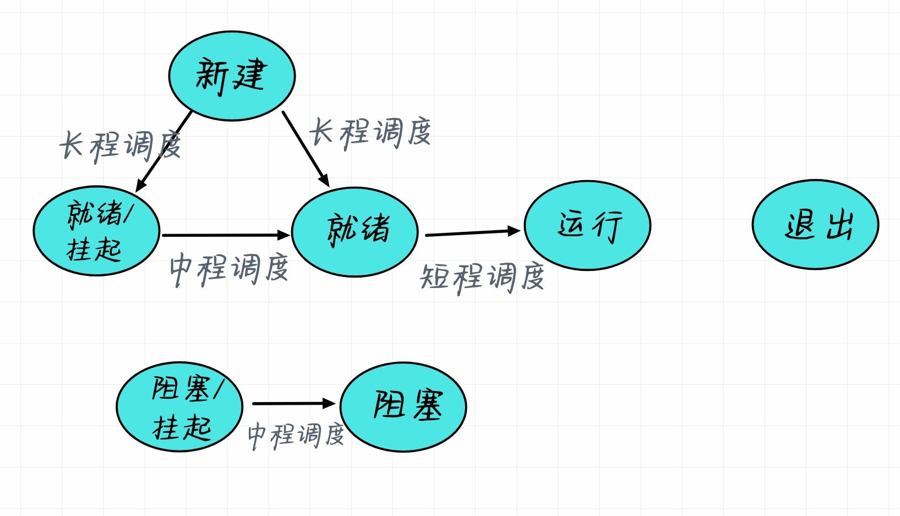
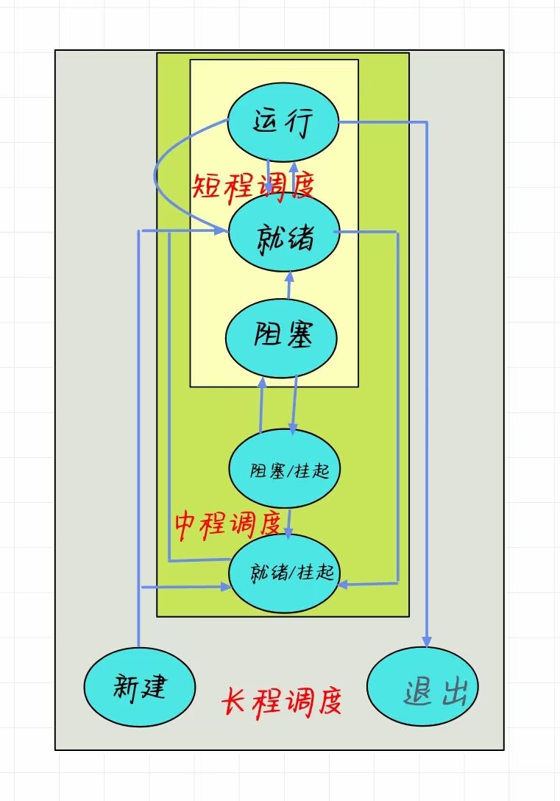
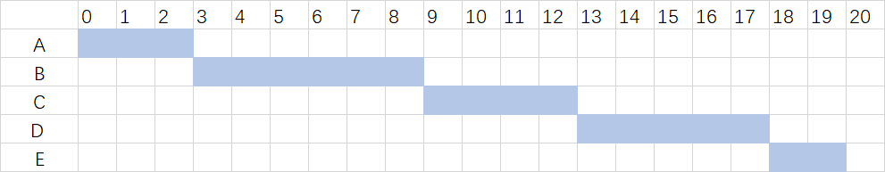
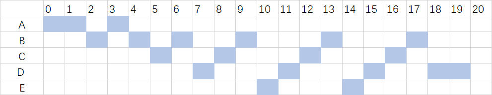
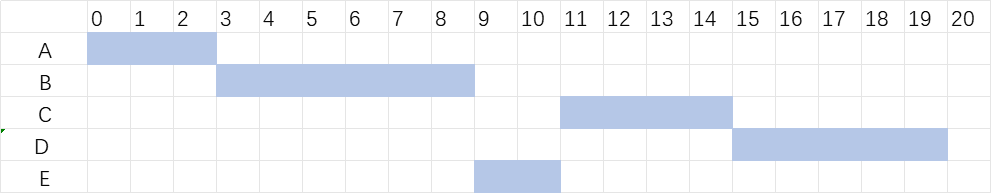
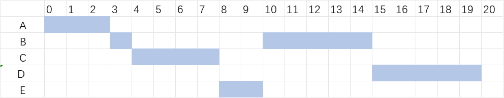

# 进程调度

## 🐮调度的类型

### 调度的引入
  
多个进程（线程竞争CPU）
- 需要选择下一个要运行的进程（线程）
- OS中完成这部分工作的程序称为调度程序
- 调度程序使用的算法叫做调度算法

### 处理器调度的类型

`目的`：满足系统目标（响应时间、吞吐量、处理器效率）的方式，把进程分配到一个或多个处理器上执行

分类：
1. 长程调度：它决定哪些新创建的进程应被接纳加入内存以供执行。其目标主要是控制活跃程序数量并尽可能使他们互补（例如，CPU密集型任务与I/O密集型任务交错运行），从而优化资源利用率和减轻竞态条件
2. 中程调度：也称为换出/换入策略或者页面置换算法, 它负责把部分已加载到内存但暂时无法执行(如等待I/O)或者优先级较低 的程序页挑选出来保存回磁盘(即"swap out") , 空余出更多物理内存给其他就绪状态且急需执行的程序使用
3. 短程调度：真正决定下次执行那个就绪程序

**调度的层次**

    

**长程调度**
- 决定那个程序可以进入系统中等待处理
- 控制系统中的并发度
  - 创建的进程越多，每个进程执行的时间比例也就越小
  - 可能限制并发度给当前进程集提供满意的服务

**中程调度**
- 交换功能的一部分
- 换入决定取决于系统并发度的要求
- 在不使用虚存的系统中，换入决策还要考虑换出进程的存储要求

**短程调度**
- 称为分派程序
- 执行最频繁
- 精确决定下次执行哪个进程
- 导致当前进程阻塞或抢占当前运行进程的`事件`发生时，调用短程调度程序
  - 时钟中断
  - I/O中断
  - 系统调用
  - 信号量

## 🐯调度的规则

### 一些基本的概念

**响应时间**

从用户提交一个请求开始，到接收响应之间的时间间隔

::: info 构成

`输传送时间` + `处理时间` + `响应传送时间` 
:::
**截止时间**

某任务必须开始执行的最迟时间，或必须完成的最迟时间

**系统吞吐量**

在单位时间内，系统所完成的进程数

**处理器利用率**

处理器处于忙状态的时间比

**周转时间**

一个进程从提交到完成之间的时间间隔

::: info  构成
`驻外存等待调度时间`  + `驻内存等待调度时间` + `执行时间` + `阻塞时间`
:::

**平均周转时间**

多个进程周转时间的平均值
::: info 公式
$$T=\frac{1}{n}[\sum_{i=1}^{n} T_{i} ]$$
:::

**带权周转时间**

进程的周转时间与系统为它提供的服务时间之比（总是大于一）
::: info 公式

$$ W_{i}=\frac{T_{i}}{T_{si}}

:::

**平均带权周转时间**

多个进程带权周转时间的平均值
::: info 公式
$$ W_{i}=\frac{1}{n} [\sum_{i=0}^{n}W_{i}]$$
:::

**吞吐量**

指系统在单位时间内处理任务的数量

### 规则

`短程调度的目标`:优化系统某方面行为的方式，来分配处理器的时间

::: tip 常见的分类
**面向用户的规则**

- 与单个用户或进程感知到的系统行为相关 ，如交互系统的响应时间
- 在所有的系统中都很重要

**面向系统的规则**
- 关注处理器的利用率（进程完成的速度）
- 更加侧重于系统的性能，所以吞吐量是系统管理员而不是普通用户所关注的
- 在用户系统里的重要性要低一些，只要用户对用户程序的响应时间可以接受，实现高吞吐量或高利用率并不是很重要
:::

::: tip 另一种分类方式

根据是否与性能相关进行划分

- <trueBlock> 性能相关 </trueBlock>: 定量的，可测量
- <trueBlock> 性能无关 </trueBlock>: 定性的，不易测量

1. `面向用户，与性能相关`：周转时间、响应时间、最后期限（截止时间）
2. `面向用户，与性能无关`：可预测性
3. `面向系统，与性能相关`：吞吐量、处理器利用率
4. `面向系统，与性能无关`：公平性、强制优先级、平衡资源
:::

### 优先级的使用

进程优先进程可能导致饥饿，可以采用动态优先级方案

## 🐷调度的决策模式

### 决策模式

**抢占（剥夺）**

- 执行进程可能被操作系统中断，并转化为就绪态
- 抢占可能发生时间
  - 新进程到达时
  - 中断发生后把一个阻塞进程置为就绪态
  - 周期性的时钟中断

**非抢占（非剥夺）**
- 执行进程只有在执行完，或因申请I/O或请求某些操作系统服务而阻塞自己时，才释放处理机

### 调度的选择函数
- 决定下次选择哪个就绪进程执行
- 可以基于优先级、资源请求或进程的执行特性
- 基于执行特性时的关键参数
  1. `w` 目前为止在系统里的等待时间
  2. `e` 目前为止花费的执行时间
  3. `s` 进程所需的总服务时间，包括`e`  这个参数需要估计或者用户提供  

## 🦌调度算法

|     进程名          | 产生时间 | 服务时间|
| ------------- |:-------------: | :-------------: |
|A |   0|3| 
|B      |2  | 6|  
|C|4 |4|
|D|6|5|
|E|8|2|

### 先来先去服务（FCFS）

选择就绪队列中存在时间最长的进程运行，即按请求CPU的顺序使用CPU

    

::: info FCFS
`平均周转时间`：$\frac{(3-0)+(9-2)+(13-4)+(18-6)+(20-8)}{5} =8.6$

`平均带权周转时间`：$\frac{\frac{(3-0)}{3}+\frac{(9-2)}{6}+\frac{(13-4)}{4}+\frac{(18-6)}{5}+\frac{(20-8)}{2} }{5} =2.56$
:::

**评价**
- 属于非抢占调度
- 有利于CPU繁忙型进程，不利于I/O繁忙型进程
- 不适合直接用于单处理器系统
- 平均周转时间长
- 对长进程有利，不利于短进程

### 时间片轮转调度算法(RR)
- 每个进程被分配一个时间片，周期性产生时钟中断，中断时当前进程进入就绪列队尾，基于FSFC选择下一个作业运行
- 如果进程在时间片内阻塞或阻塞或结束，则立即切换CPU

    

::: info RR
`平均周转时间`：$\frac{(4-0)+(18-2)+(17-4)+(20-6)+(15-8)}{5}= 10.8$

`平均带权周转时间`：$\frac{\frac{(4-0)}{3}+\frac{(18-2)}{6}+\frac{(17-4)}{4}+\frac{(20-6)}{5}+\frac{(15-8)}{2}  }{5} =2.71$
:::

**评价**
- 属于抢占调度方式
- 常用于分时系统或事务处理系统
- 时间片的设置与性能、、响应时间密切相关
  - 时间片太短：进程切换频繁，降低CPU效率
  - 时间片太长：引起对短交互进程请求的响应时间变长
  - 时间片最好略大于一次典型交互的时间
- 对CPU密集型进程有利，对I/O密集型不利

### VRR算法

增加一个辅助队列，接收I/O阻塞完成的进程，调度优先于就绪队列，但占用的处理机时间小于就绪队列的时间片

### 短进程优先(SPF/SJF)

短进程或短作业优先调度，前提为执行时间预知

    

::: info SPF
`平均周转时间`： $\frac{(3-0)+(9-2)+(15-4)+(19-5)+(11-8)}{5}=7.6$

`平均带权周转时间`：$\frac{\frac{(3-0)}{3}+\frac{(9-2)}{6}+\frac{(15-4)}{4}+\frac{(20-6)}{5}+\frac{(11-8)}{2}  }{5} =1.84$
:::

**评价**
- 非抢占调度方式
- 短进程调到队列头，可能导致长进程饥饿
- 有利于短进程，减少了平均周转时间
- 缺少剥夺机制，不利于分时系统或事务处理环境
- 进程的长短根据用户所提供的估计执行时间而定，用户估计不准时，导致该算法不一定真正做到短作业优先调度

### 剩余时间最短优先算法(SRT)

- 调度程序总是选择预期剩余时间最短的进程（当一个新进程加入就绪队列时，如果它比当前运行的进程具有更短的剩余时间，就可能抢占当前正在运行的进程）
- 在`SJF`上增加了剥夺机制

    

::: info SRT
`平均周转时间`：$\frac{(3-0)+(15-2)+(8-4)+(20-6)+(10-8)}{5}=7.2$

`平均带权周转时间`：$\frac{\frac{(3-0)}{3}+\frac{(15-2)}{6}+\frac{(8-4)}{4}+\frac{(20-6)}{5}+\frac{(10-8)}{2}  }{5} =1.59$
:::

**评价**

<trueBlock> 优点</trueBlock>：

1. 既不像FCFS那样偏袒长进程，也不像RR那样会产生很多的中断（因为时间片产生），从而减少了开销
2. 周转时间方面，SRT的性能比SJF性能要好，只要就绪，短作业会被立即执行
   

<warnBlock> 问题</warnBlock>：

- 需要估计预期的服务时间
- 存在长进程饥饿的现象
- 必须记录进程的已服务时间

### 响应比高者优先(HRRN)

当前进程执行完毕或需要阻塞时，选择就绪队列中响应比最高的进程投入执行

$$ R_{p}=\frac{等待时间+要求服务时间}{要求服务时间} =\frac{w+s}{s} $$

    

::: info HRRN
`平均周转时间`：$\frac{(3-0)+(9-2)+(13-4)+(20-6)+(15-8)}{5}=8$

`平均带权周转时间`：$\frac{\frac{(3-0)}{3}+\frac{(9-2)}{6}+\frac{(13-4)}{4}+\frac{(20-6)}{5}+\frac{(15-8)}{2}}{5} =2.14$
:::

**评价**
- 实质上是一种动态优先权调度算法
- 这种进程说明了进程的年龄，具有吸引能力
- 是FCFS和SJF的结合，既照顾了短进程；又考虑了作业的先后次序，不会使长进程得不到服务
- 但是利用该算法，每次调度之前都必须做响应比计算，会增加系统的开销，且难以准确计算

### 反馈调度算法(FB)

- 采用“惩罚运行时间比较久的进程”的思想
- 关注的是“已经执行”的时间
- 根据进程执行的历史，调度基于抢占原则
- 采用动态优先级机制，可以获得更好的性能
- 
`q=1`

    

`q=2^i`

    

::: info FB  q=2^i
`平均周转时间`：$\frac{(4-0)+(17-2)+(18-4)+(20-6)+(14-8)}{5}= 10.6$

`平均带权周转时间`：$\frac{\frac{(4-0)}{3}+\frac{(17-2)}{6}+\frac{(18-4)}{4}+\frac{(20-6)}{5}+\frac{(14-8)}{2}}{5} =2.63$
:::

**评价**
- 有利于终端型作用用户（常为短作业，能够在第一队列所规定的时间片内完成）
- 对短作业有利
- 长进程：依次在后面队列进行运行，随着优先级的下降，分配的时间片增加，坚减少了抢占次数
- 问题就是不断地有新进程来临，长进程仍可能饥饿

## 🐗实时系统与实时调度

### 实时系统

系统能够及时响应外部事件的请求，在规定的时间内完成对该事件的处理，并控制所有的实时任务协调一致的进行

`实时控制系统`+`实时信息处理系统`

**实时任务**
具有及时性要求性、常常被重复执行的特定进程，在实时系统中习惯的称为任务

**截止时间**
- `开始截止时间`：任务在某时间以前，必须开始执行
- `完成截止时间`：任务的完成在某时间以前必须完成

### 实时操作系统系统特点
- `可确定性`：任务按照固定的、预先确定的时间或时间间隔进行
- `可响应性`：关注系统在知道中断之后为中断提供服务的时间
- `用户控制`：用户能够区分软、硬实时任务，并控制优先级（硬实时任务比较严格：自动驾驶 软实时任务可以接受一定延迟）
- `可靠性`：实时响应控制事件，保障性能
- `失效弱化性`：系统具有稳定性，当不能满足所有任务的实时时，首先满足重要的、优先级高的任务的期限，减少系统故障

###  实时进程调度方式

**基于时间片的轮转调度**
- 实时进程按时间片轮转方式运行，到达的实时进程放在就绪队尾
- 新进程的时间片到时，调度
- 效应级一般为秒级
- 广泛用于分时系统及一般实时处理系统

**基于优先级的非抢占调度**
- 实时进程按优先级、非抢占方式执行，新到的实时进程就放在就绪队列首部
- 当前进程阻塞或完成时，立即调度新进程
- 响应时间一般在数百毫秒至数秒范围
- 多用于处于多道处理系统不太严格的实时系统

**基于优先级的抢占点抢占调度**
- 实时系统按照优先级、抢占方式执行
- 当下一个剥夺点到来时，立即占用CPU
- 响应时间一般在几毫秒至几十毫秒
- 用于一般的实时系统

**立即抢占式调度**
- 实时进程按优先级、抢占方式运行
- 响应时间为微秒至毫秒级
- 用于苛刻的实时系统

### 实时调度的方法分类

**静态表驱动调度法**
- 用于调度周期性的实时任务
- 按照任务周期到达的时间、执行的时间、完成截止时间以及任务的优先级，制定调度表
- 最早截止时间优先（EDF）调度算法属于此类

**静态优先级抢占调度法**
- 此类算法多用于非实时多道程序系统
- 优先级的确定方法有很多，可以对I/O密集型和CPU密集型赋予不同的优先级
- 实时系统中对任务的限定时间赋予优先级
- 速度单调算法（RM）

**基于动态规划的调度法**
- 当实时任务到达后，系统为新到达的任务和正在执行的任务动态的建立
- 在当前的执行的进程不会错过其截止时间的条件下，如果也能使新到达任务在截止时间内完成，即立即调度执行新任务

**动态尽力调度法**
- 广泛非周期实时任务调度
- 当任务到达时，系统根据其属性赋予优先级，优先级高的先调度
- 缺点在于，当任务完成时，或截止时间到达时，很难知道该任务是否满足约束时间

### 限期调度

任务开始或结束的截止时间

**调度所需的信息**
- `就绪时间`
- `启动的期限`
- `完成的期限`
- `处理的时间`：任务执行到完成的时间
- `资源需求`：任务执行过程中所需的资源集
- `优先级`：度量任务的相对重要性
- `子任务结构`：一个任务可分解成一个必须执行的子任务和一个可执行子任务，前者有硬截止时间

**需要考虑的问题**
::: tip 问题
1. 下次调度哪个任务
  
  根据任务的deadline,选择deadline最早的任务调度，这样可使超过deadline的任务数最少

2. 采用什么方式抢占
    - 对于启动限期明确的任务，采用非抢占方式
    - 对于完成限期的实时系统，采用抢占策略
    - 对于具有完成限期的周期性实时任务，采用最早截止时间优先调度算法
    - 对于开始限期的非周期实时任务 ，采用允许CPU空闲的EDF调度算法

:::

**速率单调调度算法(RMS)**

- 适用于周期性任务
- `优先级的确定`：任务的周期越短，优先级越高；优先级是任务速度单调递增的函数
- 系统按照任务优先级的高低进行调度

::: warning 处理能力限制

假定系统中有m个周期性的硬实时任务，任务i的处理时间为Ci,周期为Pi ，在单处理机的情况下，必须满足下面的限制条件

$$\sum_{i=1}^{m} \frac{C_{i} }{P_{i}} \le 1$$
:::

**优先级反转**

一个高优先级任务间接被一个低优先级任务抢先，两个任务的相对优先级倒置

<trueBlock>解决方法</trueBlock>：

1. `优先级继承`：任何较低的任务继承任何与其共享同一资源的优先级较高的任务的优先级
2. `优先级顶置`: 优先级与每个资源相关联，资源的优先级被设定为比使用该资源具有最高优先级的任务高一级。程序动态的将这个优先级分配给任何访问资源的任务，一旦任务使用完资源，优先级就返回以前的值