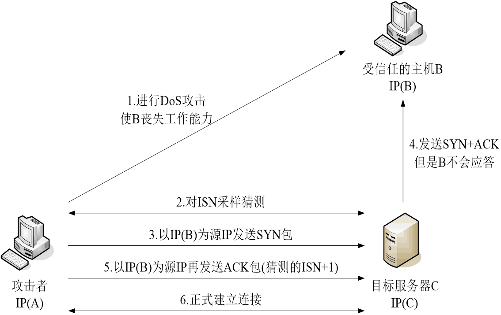

# TCP/IP 网络协议安全攻防

## 概述

### 网络安全CIA

- 机密性(Confidentiality)
- 完整性(Integrity)
- 可用性(Availability)

**补充的两个属性**
- 真实性
- 不可抵赖性

### 网络攻击基本模式

- 截获
  - 嗅探
  - 监听
- 篡改
  - 数据包篡改
- 中断
  - 拒绝服务
- 伪造
  - 欺骗

**中间人攻击**

- 与通信双方建立起各自独立的会话连接
- 对双方进行身份欺骗
- 进行消息的双向转发
- 拦截通信双方的全部通信(截获)、转发篡改消息(篡改)、双方身份欺骗(伪造)

### 安全缺陷与攻击技术

**网络接口层**
- 以太网协议
  - 共享传输媒介并明文传输
  - 缺乏MAC身份认证机制
- PPP协议
  - 明文传输

**互联层**
- IPV4 
  - 缺乏IP地址身份认证机制
  - 处理IP分片时的逻辑错误
- ICMP
  - ICMP路由重定向缺乏身份认证
  - 广播地址对ping的放大器效应
- ARP 
  - 采用广播查询且没有验证机制

**传输层**
- TCP
  - tcp三次握手在连接队列瓶颈
  - tcp会话身份认证不够安全
- UDP
  - 无连接(易于作为flood攻击)

**应用层**
- DNS 
  - DNS验证机制不够安全
- SMB
  - 缺乏HTML认证机制
- HTTP
  - URL明文，缺乏安全性保护
  - 内嵌滥用

## IP源地址欺骗

伪造具有虚假地址的IP数据包进行发送

**目的**

隐藏攻击者身份、假冒其他计算机通过身份验证

**原理**

路由转发器只是用目标IP地址，不对源IP做验证

**欺骗的两种场景**
- on-path spoofing
  - 攻击者位于数据包的发送路径上，也就是说，他们可以直接观察到或者拦截数据包
- off-path spoofing
  - 攻击者并不直接在数据包的发送路径上，也就是说，他们不能直接观察到或者拦截数据包。然而，他们可以通过其他方式来伪造数据包，例如通过猜测序列号或者利用协议的漏洞

**盲攻击过程**

    

### 应用的场景

- 拒绝服务攻击(不期望响应包，节省带宽，隐藏攻击源)
- 网络扫描(将真正的扫描源隐藏于一些欺骗的源ip中)
  - 一般存在于局域网中
- 对付基于IP地址身份认证机制
- 完成主机ip欺骗-盲攻击，较难实现

### 依赖于ip源欺骗的其他网络攻击协议的攻击
- ICMP放大攻击
- DNS放大攻击
- ICMP路由重定向攻击
- TCP RST攻击
- DNS Spoofing攻击
- DDoS分布式拒绝攻击
  - SYN Flooding 攻击
  - UDP Flooding 攻击

### IP 源地址欺骗的防范措施

- 使用随机化的初始序列号
  - 避免远程盲攻击
- 使用网络层安全传输协议
  - 避免高层协议可利用的信息及传输内容
- 避免采用基于IP地址的信任策略
  - 以基于加密算法的用户身份认证机制来代替
- 在路由器和网关上实施包检查和过滤
  - 入站过滤机制
  - 出站过滤机制
- 真实源IP地址验证

## ARP 欺骗

地址解析协议

## ICMP路由器重定向攻击

攻击者伪造ICMP路由器重定向消息，试图欺骗主机，让主机将数据包发送到攻击者指定的路由器

## RST 攻击

一种网络攻击方式，攻击者通过发送伪造的TCP RST（Reset）包，来中断TCP连接。TCP RST包是TCP协议中的一种控制消息，用来请求终止一个TCP连接

**应用场景**
- 恶意拒绝服务攻击
- 重置入侵连接

**RST 包产生的正常场景**
- 从未建立TCP连接的主机接收到任意TCP包
- 在关闭端口接收到SYN包请求连接
- 接受到无效或错误的SEQ值或ACK值的TCP包

**对于RST的响应处理**
- 首先检测RST包是否是有效的，协议栈接收并验证SEQ值
- 如果当前的TCP协议状态为LISTEN,忽略
- 如果SYN_RECEIVED,回到LISTEN状态
- 其他任何状态，导致连接关闭，进入CLOSE状态

## DNS Spoofing 攻击

- on-Path DNS Spoofing
  - 嗅探DNS请求包
  - 注入应答DNS包进行混淆

## TCP 中SYN 洪泛攻击与防范

在SYN洪泛攻击中，攻击者会快速连续地发送大量的SYN包给目标服务器，但是并不会发送最后的ACK包来完成握手过程。这样，服务器就会为这些半开放的连接分配大量的资源，但是这些资源实际上并没有被有效地使用。最终，服务器的资源会被耗尽，无法处理正常的网络请求

### 防范措施

**无状态的三次握手**

- 服务器收到一个SYN报文后，不立即分配缓冲区
- 利用连接信息生产一个cookie，作为SEQ
- 客户端返回ACK中，带着ACK=cookie+1
- 服务器端核对cookie，建立连接，分配资源

**有状态的防火墙**

当一个新的连接请求（如TCP的SYN请求）到达时，防火墙会检查其规则集以决定是否允许这个连接。如果允许，防火墙将在其状态表中创建一个新的条目，记录这个连接的状态信息（如源和目标IP地址、端口号、协议类型、序列号等）。然后，防火墙将根据这个状态表来处理后续的数据包。只有当数据包的信息与状态表中的一个条目匹配时，数据包才会被允许通过。当连接关闭或超时时，防火墙将从状态表中删除相应的条目

## 攻击防范措施

- 网络接口层(主要的安全威胁是网络嗅探)
  - 局域网中的监听点技术
  - 各类网络采用上层加密技术
- 互联层(IPsec)
  - 使用检测技术过滤技术来阻断网络中欺骗技术
  - 增强防火墙、路由器和网关设备的安全策略
- 传输层
  - 加密传输和安全控制机制
- 应用层
  - 加密、用户级身份验证、数字签名技术、入侵检测
