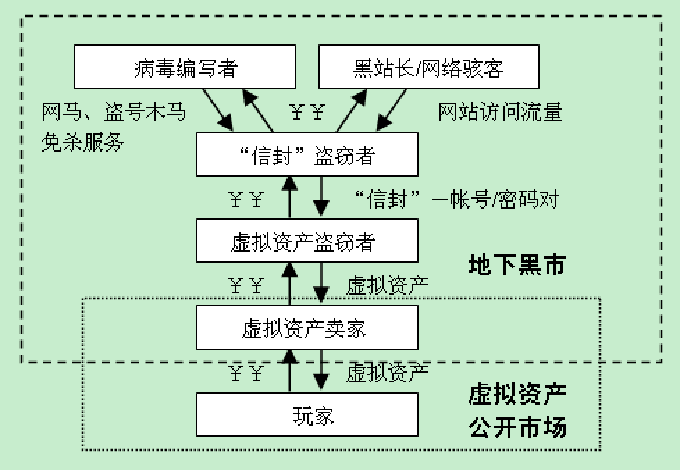

# Web浏览器安全

## Web浏览器技术的发展与安全威胁

Web浏览器显示网页服务或文件系统内的文件，并让用户与这些文件进行交互的一种软件

### 安全困境三要素
- 复杂性(复杂软件意味着更多的错误与安全缺陷)
- 可拓展性(拓展性插件存在安全漏洞)
- 连通性(浏览器始终处于工作状态，一旦存在安全漏洞，很容易被发现)

### 浏览器安全问题的位置
- Web浏览器系统平台的安全威胁
- 浏览器本身
- 浏览器的插件、集成的应用程序
- 针对使用者的社会工程学攻击威胁

### 威胁类型
- 网络钓鱼
- 恶意木马与流氓软件下载
- 网页木马
- 不良信息

## 网络钓鱼

获取个人敏感信息
  - 用户名、口令、账户ID
  - 网银、ATM PIN 或信用卡信息

### 架设钓鱼网站

- 前台假冒网站：知名的金融机构、在线商务网站
  - 组织性：集中服务器上存放多个目标的钓鱼网站页面脚本
- 后台脚本：收集、验证用户输入，并通过某种渠道转发给钓鱼者

### 欺骗用户访问钓鱼网站

- DNS 中毒攻击
- Pharming 网络流量重定向
- 社会工程学-欺骗性垃圾邮件

### 欺骗性垃圾邮箱

## 恶意木马与流氓软件下载

## 网页木马-浏览器的渗透攻击

### 网络访问流量重定向机制
- 内嵌HTML标签(iframe嵌入外部页面链接)
- 恶意script脚本(利用script标签通过跨站脚本包含网页木马)
- 内嵌对象(调用第三方应用软件或浏览器帮助对象（BHO）的内嵌对象)

### 网页木马“感染链”

网页木马通常不会直接存放于被挂马页面中，通过多层嵌套的内嵌连接、跨站脚本等方式构建网马“感染链”
- 便于攻击者管理与统计
- 通过混淆加大防御者分析的难度

### 地下经济链调查分析

    

- “信封”盗窃者：盗窃的账户和密码信息