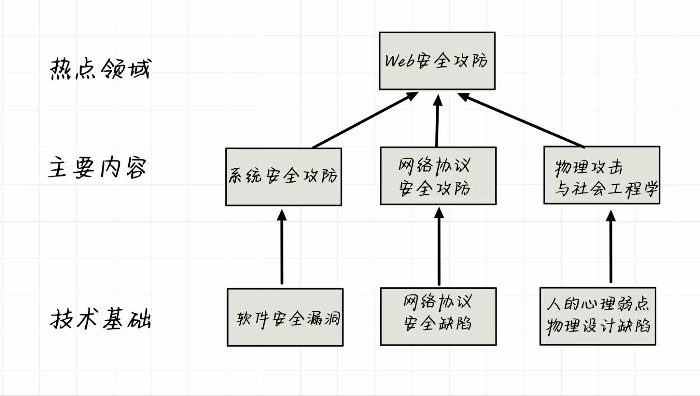
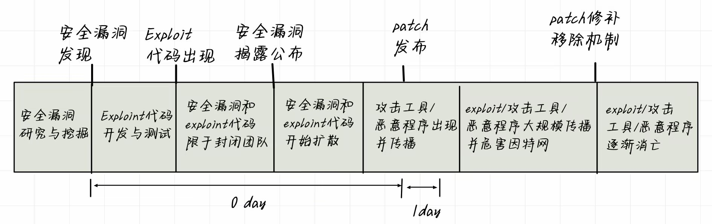

# 概述

## 黛蛇蠕虫机理

1. 攻击MSDTC、WINS、uPnP、MSSQL服务漏洞，注入Shellcode
2. 连接控制服务器，获取下载FTP服务器位置和指令
3. 下载黛蛇蠕虫
4. 激活黛蛇感染目标
5. 进一步传播

## 🦀黑客与黑客道

Kevin 米特尼克 —— 世界头号通缉黑客
Robert 莫里斯 —— 第一个黑客判罚案例

**黑客(hacker)**

用斧头做家具的能工巧匠

- 享受探索系统的实现细节，拓展系统能力的人
- 编程狂热者，甚至编程强迫症患者
- 能够欣赏黑客能力和价值的人
- 能够快速提升编程能力的人
- 在某种编程语言和系统上的专家和高手
- 在任意特定领域上的专家和技术狂热者
- 以创造性突破极限的智力挑战为追求和享受的

**骇客(cracker)**

通过到处刺探尝试发现敏感信息的恶意攻击者，他们应该被称为骇客

##  🦞网络安全攻防技术概述

    

### “极光”APT攻击事件
- 发送带有恶意网站URL的欺骗邮件，诱骗点击
- 访问恶意网站时，被客户端渗透代码攻击IE零日极光漏洞，植入恶意代码
- 加密伪装方式连接控制服务器，接受攻击者控制命令
- 通过信任关系进行`Man-in-the-Mailbox`攻击，诱骗访问恶意网站
- 监听窃取关键知识产权资料

### 网络攻击协议

`TCP/IP`网络协议在设计时存在安全缺陷或不安全的因素

- `网络接口层`：基于广播的形式，有可能会被嗅探
- `网络互联层`：IP源地址欺骗、ARP欺骗、ICMP协议攻击
- `传输层`：TCP重置攻击、回话劫持、SYN洪泛
- `应用层`：敏感信息窃听，篡改与信息假冒

### 漏洞生命周期

    

`0 day`:从安全漏洞发现到厂商发布补丁程序用于修复该漏洞之前的这段时间，这段时间里面，攻击者攻击漏洞的成功率为100%

`1 day`:厂商发布安全漏洞的补丁程序，但是补丁程序也需要一段时间被接受、下载与应用
