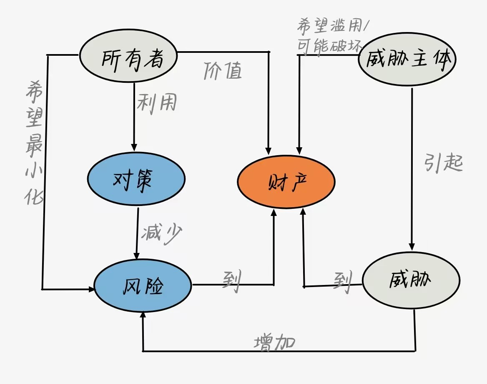
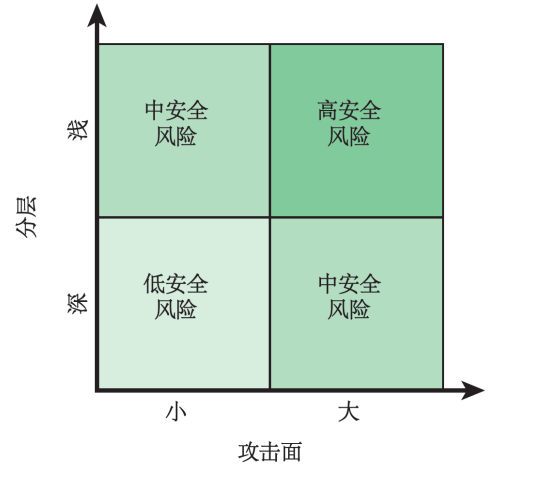
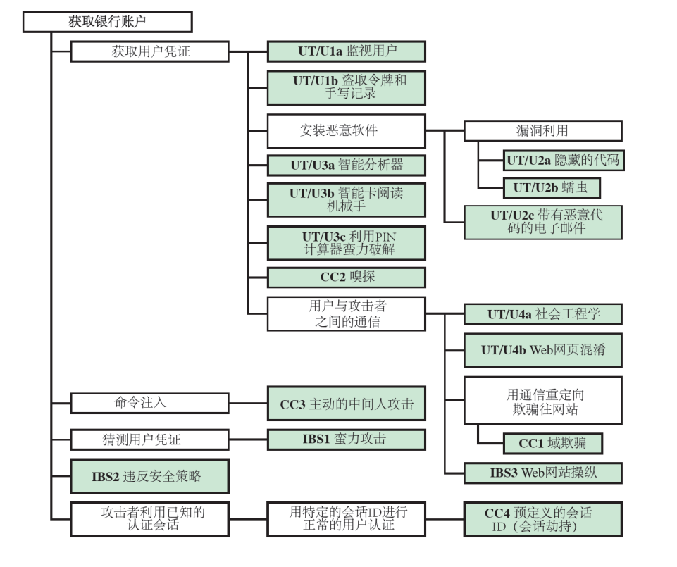

# 概述

## 🧚🏻计算机安全基本概念

### 定义
保证信息系统的资产的`机密性`、`完整性`和`可用性`的措施和控制方法，其中资产包括硬件、软件、固体以及要处理、存储和通信的信息

### 安全目标
**机密性（confidentiality）**
- `数据机密性`：确保隐私或机密信息不被非授权的个人使用，或被泄露给非授权的个人
- `隐私性`：确保个人能够控制或影响与自身相关的信息的收集和存储，也能够控制这些信息可以由谁披露或向谁披露

**完整性（integrity）**
- `数据完整性`：确保信息和程序只能在指定的和得到授权的情况下才能够被改变
- `系统完整性`：确保系统在未受损的方式下执行预期的功能，避免对系统进行有意或无意的非授权操作
  
**可用性（availability）**
确保系统能够及时响应，并且不能拒绝授权用户的服务请求

除了上述的安全基本的`CIA`三元组，还有一些经常提到的安全目标：

**真实性**
一种能被验证和信任的表示真实情况或正确程度的属性，它使得传输、消息和消息源的有效性可以被充分的相信

**可说明性**
安全目标要求实体的动作能够被`唯一`(没有歧义)的追踪

### 安全级别分类
- `低级`：安全缺失会给机构运转、机构资产或个人带来有限的负面影响
- `中级`：安全缺失会给机构运转、机构资产或个人带来严重的负面影响
- `高级`：安全缺失会给机构运转、机构资产或个人带来灾难性的负面影响

### 计算机安全面临的挑战

**计算机安全问题和挑战**

- 计算机安全问题并不像初学者想象的那么简单
- 在开发某种安全机制或算法时，我们必须始终考虑对这些安全特征的潜在攻击
- 从本质上说，计算机安全就是利用安全脆弱性进行破坏的攻击者和尽力阻止攻击设计者或管理者之间的一场智力较量

**安全设计与实施**

- 对于已经设计各种类型保护措施而言, 决定其适用环境非常重要.
- 安全部署通常包含多个步骤如选择合适协议、生成密钥等，并需要解决诸如创建、分发和保护该密钥信息之类难题.

**用户态度与认知**

 - 对许多用户以及系统管理员来说，在没有出现明显风险前他们往往忽视投资提高系统防范能力。
 - 很多人认为过度追求完善保护可能会影响到工作效率以及操作方便性.

**系统监控与维护**
 
 - 安全系统要求定期甚至持续的运行观察，然而在当前注重效率、超负荷工作环境中很难做到。

**安全性在系统设计中的地位**

- 如今安全机制通常是事后考虑问题，在系统基本完成后才开始整合进去，而不是作为设计过程中有机组成部分来看待。

### 计算机安全术语

- 敌手：进行或有意进行有害活动的个人、团体、组织或政府
- 攻击：任何类型的恶意活动，试图收集、破坏、拒绝、降级，或者破坏信息系统资源或任何信息本身
- 对策：一种或（多种）设备或技术，其目的是削弱不良或者有害活动操作的有效性，或防止间谍、破坏、盗窃、或者未经授权访问活或使用敏感信息（或信息系统）
- 风险：衡量一个实体受潜在环境或事件威胁程度
   1. 环境或事件发生时可能产生的不利影响的函数
   2. 发生的可能性

- 安全策略：提供安全服务的一套标准。定义和约束数据处理设施的活动，以维持系统和数据的安全状况
- 系统资源：主要应用程序、通用支持系统、高影响程序、物理工厂、关键任务系统、人员、设备或逻辑相关的系统组
- 威胁：任何可能通过未授权的访问、销毁、披露修改以及拒绝服务而对组织运营、组织财产、个人、其他组织或国家产生不利影响的情况或事件
- 脆弱性：可能被威胁利用或触发的信息系统、系统安全程序、内部控制或实现中的弱点

    

## 🕵🏻威胁、攻击和资产

### 计算机的资源
- 硬件
- 软件
- 数据
- 通信线路和网络

**脆弱性**
1. `损坏`：数据的完整性缺失
2. `泄露`：机密性丢失
3. `不可用`：系统或网络变得不可能或不现实

### 威胁

利用安全脆弱性产生威胁的能力，表示对资产的潜在安全危害

|     威胁后果          | 威胁动作（攻击） |
| ------------- |:-------------: | 
|非授权泄露|`暴露`：敏感数据被直接泄露给非授权实体 `截获`：非授权实体直接访问在授权源与目的地之间传输的敏感数据 `推理`：非授权实体通过基于特征的推理或通信产品间接访问敏感数据 `入侵`：非授权实体通过躲避系统安全保护措施来获得对敏感数据的访问| 
|欺骗     |`冒充`：非授权实体通过彼此伪装成授权实体访问系统或执行恶意行为 `伪造`：以虚假数据欺骗授权实体  `抵赖`：一个实体通过虚伪否认对一个行为负责而欺骗另一实体| 
|破坏|`失能`：通过禁用系统组件来阻止或终端系统运行  `损坏`：通过对系统功能或数据的不利修改来对系统进行非期望的改变 `阻碍`：通过对阻止系统运行来终端系统交付威胁活动 |
|篡夺|`盗用`：实体对系统资源采用非授权的逻辑或物理控制(拒绝服务攻击)  `误用`：导致系统组件执行对系统安全有害的功能或服务|

**威胁的举例**
|          |可用性  |机密性|完整性|
| ------------- |:-------------: |:-------------: | :-------------: | 
|硬件|设备被偷盗，因而拒绝提供服务| 未加密的USB被盗||
|软件    |程序被删除，拒绝用户访问|软件的非授权拷贝|正在运行的程序被修改，使其在执行过程中失败或执行一些非预期的任务| 
|数据|文件被删除，拒绝用户访问 |非授权读取数据，分析统计数据来揭露潜在深层次的数据|修改文件或伪造新文件|
|通信线路 和网络|消息被破坏或删除。通信线路或网络不可用|消息被读取，消息的流量模式被观察到|消息被修改、延迟、重新排序或复制。伪造虚假消息|

### 攻击

**主动攻击**

试图改变系统的资源或影响其运行，包括对数据流进行篡改或伪造数据流

- 重放
- 冒充
- 篡改信息
- 拒绝服务

**被动攻击**

窃听或监视数据的传输，攻击者目标是获取传输文件中可能包含敏感或机密信息

- `消息内容透露`：黑客试图捕获和分析数据包以获取其中包含的敏感信息
- `流量分析`： 这种类型的被动监听不直接关注交换信息本身（尽管它们可以），而主要侧重于观察模式、频率和数量等数据特征

### 对策

应对安全攻击所采取的任何手段

- 阻止
- 检测
- 恢复

::: danger 注意

在执行安全策略之后，还可能引入新的脆弱性
:::

## 🦸🏻安全功能要求

::: info 安全要求
- 访问控制
- 意识和培训
- 审计和可说明性
- 认证、信赖和安全评估
- 配置管理
- 应急规划
- 识别与认证
- 事故响应
- 维护
- 介质保护
- 物理和环境保护
- 规划
- 人员安全
- 风险评估
- 系统和服务的获取
- 系统和通信的保护
- 系统和信息完整性
:::

## 🧞基本安全设计原则

- `经济机制原则`：在嵌入硬件和软件中的安全机制的设计要尽可能简单
- `安全缺省设置原则`：访问控制应该基于许可而不是排除，缺省的情况下是不允许访问的
- `绝对中介原则`：每一次访问应当依据访问控制机制进行检查
- `开放式设计原则`：安全机制的设计应该开放而不是保密
- `特权分离原则`：对于限定资源的访问需要多特权属情况定义的
- `最小特权原则`：每个进程和系统用户都应当使用完成某项任务所必需的最小特权集进行操作
- `最小共用机制原则`：设计时最小化不同用户共享的功能，提高彼此的安全性
- `心理可接受性原则`：安全机制不应该过度干涉用户的工作，同时也要满足用户授权访问的要求
- `隔离原则`：
  - 公共访问资源应当与重要的资源分离，以免其被暴露或纂改
  - 个人用户进程和文件也应当他人相隔离
  - 安全机制应该被隔离
- `封装原则`：可将其视为面向对象功能的一种特殊形式的隔离
- `模块化原则`：在安全的背景下指将各个安全功能开发成分离的、受保护的模块，也指使用模块化架构进行安全机制的设计与实现
- `分层原则`：使用多重的、重叠的保护办法，他强调的是信息系统的人员、技术和操作方面
- `最小惊动原则`：程序或用户界面的响应方式应当尽量不出乎于用户的意料，不至于惊吓用户

## 👨🏻‍🌾攻击面和攻击树

### 攻击面

系统中可以到达的和可被利用的脆弱点构成

**例子**
- 对外开放的Web和其他服务器的端口，以及监听这些端口代码
- 在防火墙内可用的服务
- 处理进入内部的数据、电子邮件、XML、办公文档和工业级定制数据交换格式代码
- 接口，SQL和Web表单
- 对敏感信息有访问权限的员工，这些敏感数据可能会受到社会工程学的攻击

 **分类**
|网络攻击面  |软件攻击面|人为攻击面|
| ------------- |:-------------: |:-------------: | 
|企业网、广域网或因特网中的脆弱点|应用程序、实用程序或操作系统代码中的漏洞|员工或外部人员（社会工程学）引起大的脆弱点 |

**深度防御与攻击面**

    

### 攻击树

一个分支型的、层次化的结构数据，表示了一系列潜在技术，这些技术可利用安全漏洞进行攻击

**网银认证的攻击树**

    

::: tip 解析

`根节点(获取银行账号)`：攻击者的目标

攻击者可以迭代的、递增地达到这个目标途径就是这棵树的分支和子节点。每个子节点定义了一个子目标，每个子目标都有进一步的子目标。从根节点沿着路径向外延伸的最终的节点，代表发生攻击一个攻击的不同方式

:::

## 👮🏻计算机安全策略

### 安全策略
  
规定或控制系统及组织如何提供安全服务来保护敏感和关键的系统资源的规则与实践的形式化陈述

**需要考虑的因素**
- 需要保护资产的价值
- 系统的脆弱性
- 潜在的威胁和可能得攻击

::: warnning 注意

安全策略需要考虑 `易用性与安全` 、`安全成本与失效-恢复成本`
:::

### 安全措施

- `预防`：采取适当措施防止非法的访问
- `检测`：通过检测，检测出非法的攻击
- `响应`：系统感觉到不正当的访问，作出相对应的响应，终止进一步的危害
- `恢复`：如果数据出现损坏，可以重新装载以前正确的数据备份

### 保证与评估

**保证**

信息系统的一个属性，为系统运行提供了可靠的依据，从而实现了系统的安全策略

**评估**
- 依据某准则检查计算机产品或系统的过程
- 可能包括形式化分析或数学技术

## 👨🏻‍🎓标准

::: info 一些重要的组织
`美国国家标准与技术研究所 (NIST)`

   NIST是美国联邦政府的一个机构，负责制定美国政府使用的度量科学、标准和技术，也负责推动美国私营企业的创新

`Internet 协会 (ISOC)`

  ISOC 是一个专业的成员联盟，其拥有世界性的组织成员和个人成员。在诸如Internet的前沿问题上，它处于领导者的地位

`ITU 电信标准化部门 (ITU-T)`

  ITU 是联合国系统中的一个国际化组织，各国政府和私营企业在它的领导下一期协调全球的电子通信网络和服务

`国际标准化组织 (ISO)`

  ISO 是一个由全球140多个国家的国家标准组织参加的世界联盟。ISO 是一个非政府组织，负责推动标准化的发展
:::