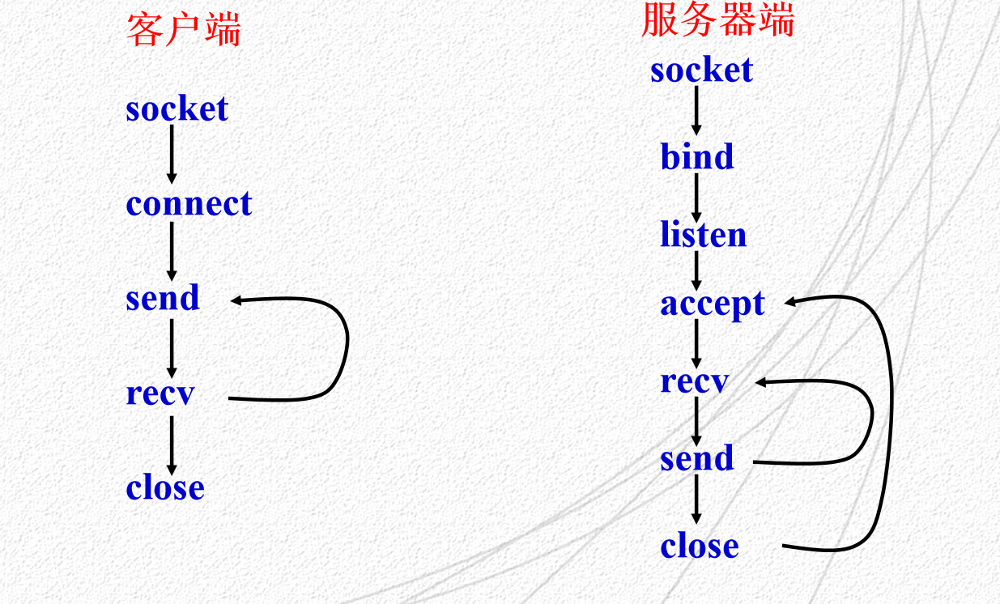

# 套接字API

## 套接字API 介绍

## 套接字API 中的主要系统调用

### 套接字分类

::: tip
1. **主要的系统调用**：这些是创建套接字、建立连接、发送和接收数据等核心功能的基础。这些调用通常包括但不限于：

   - `socket()`：创建一个新的套接字。
   - `bind()`：将套接字绑定到一个特定的地址（例如，一个特定的端口号或一个特定的IP地址）。
   - `listen()`：使一个未连接的套接字进入监听状态，等待来自客户端的连接请求。
   - `accept()`：接收来自客户端的连接请求。
   - `connect()`：发起到服务器的连接请求。
   - `send()`, `recv()`：用于发送和接收数据。
   - `close()`：关闭一个套接字连接。

2. **实用例程**：这些是辅助函数，它们提供了一些额外的功能，如解析主机名、处理网络地址等。这些函数包括但不限于：

   - `gethostbyname()`, `gethostbyaddr()`：用于解析主机名和地址。
   - `htonl()`, `htons()`, `ntohl()`, `ntohs()`：用于处理网络字节序和主机字节序之间的转换。
提供帮助


:::
### 套接字调用方式
::: tip 

1. **套接字类型**：在创建套接字时，你可以选择套接字的类型。例如，你可以选择创建一个流套接字（SOCK_STREAM）

2. **协议族**：在创建套接字时，你还需要选择一个协议族（例如，AF_INET 对于 IPv4，AF_INET6 对于 IPv6）。
3. **地址和端口**：当你绑定（bind）或连接（connect）到一个地址时，你需要提供一个地址结构体，这个结构体包含了 IP 地址和端口号。

4. **选项**：套接字提供了一套强大的选项系统，允许你控制套接字的许多方面。例如，你可以设置套接字为非阻塞模式，这样在尝试读取数据但没有数据可读时，套接字不会阻塞你的程序。

:::
## 一些主调用套接字API
### Socket 函数

```c
int Socket(int domain, int type, int protocol);
```

这个函数用于创建一个新的套接字，并返回套接字描述符。

**参数说明**

1. `domain`：这是域类型，它指明了要使用的协议栈。例如，对于 TCP/IP，我们使用 `PF_INET`。

2. `type`：这是服务类型。以下是一些可能的选项：
    - `SOCK_DGRAM`：这意味着你想要数据报服务，这通常与 UDP 协议一起使用。
    - `SOCK_STREAM`：这意味着你想要流服务，这通常与 TCP 协议一起使用。
<details>
<summary>3. <code>protocol</code>：这通常设置为 0</summary>
 大多数情况下，因为每个套接字类型通常只有一种协议与之关联。所以可以设置为0 ,让系统会自动选择与你指定的套接字类型相对应的协议
</details>

### Connect
``` c
int Connect（int sockfd,struct sockaddr *server_addr,int sockaddr_len）
```
`客户端调用`：同远程服务器建立主动连接，成功时返回0，若连接失败返回－1。

**参数说明**
1. `Sockfd`:套接字描述符，指明创建连接的套接字

2. `Server_addr`:指明远程端点：IP地址和端口号
3. `sockaddr_len` :地址长度

### send
``` c
int Send(int sockfd, const void * data, int data_len, unsigned int flags)

```
在TCP连接上发送数据,返回成功传送数据的长度，出错时返回－1.

也可以使用send发送“面向连接”的UDP报文
**参数说明**
1. `sockfd`:套接字描述符
2. `data`:指向要发送数据的指针
3. `data_len`:数据长度
4. `flags`:一般为0 定义`send`的一些行为

### Sendto
``` c
int Sendto(int sockfd, const void * data, int data_len, unsigned int flags, struct sockaddr *remaddr,int remaddr_len)
```
基于UDP发送数据报，返回实际发送的数据长度，出错时返回－1

**参数说明**

1. `sockfd`:套接字描述符
2. `data`:指向要发送数据的指针
3. `data_len`:数据长度
4. `flags`:一般为0
5. `remaddr`:远端地址：IP地址和端口号
6. `remaddr_len` :地址长度

### recv
``` c
int recv(int sockfd, void *buf, int buf_len,unsigned int flags); 
```
从TCP接收数据,返回实际接收的数据长度，出错时返回－1。如果收到的数据的长度大于缓存区，多余的数据将会丢弃

**参数说明**
1. `Sockfd`:套接字描述符
2. `Buf`:指向内存块的指针
3. `Buf_len`:内存块大小，以字节为单位
4. `flags`:一般为0 

### recvfrom
``` c
int recvfrom(int sockfd, void *buf, int buf_len,unsigned int flags,struct sockaddr *from,int fromlen)

```
从UDP接收数据，返回实际接收的字节数，失败时返回－1

**参数说明**
1. `Sockfd`:套接字描述符
2. `buf`:指向内存块的指针
3. `buf_len`:内存块大小，以字节为单位
4. `flags`:一般为0
5. `from`:远端的地址，IP地址和端口号
6. `fromlen`:远端地址长度

### close
``` c
close(int sockfd)
```
撤销套接字
如果只有一个进程使用该套接字，直接撤销；多个使用，引用数减一
**参数说明**
`Sockfd`:套接字描述符

### bind
``` c
int bind(int sockfd,struct sockaddr * my_addr,int addrlen)
```
为套接字指明一个本地端点地址
**参数说明**
1. `Sockfd`:套接字描述符，指明创建连接的套接字
2. `my_addr`:本地地址，IP地址和端口号
3. `addrlen` :地址长度
### listen
``` c
int listen(int sockfd,int input_queue_size)
```
`服务器`：面向连接的套接字使用它将一个套接字置为`被动模式`，并准备接收传入连接
**参数说明**
1. `Sockfd`:套接字描述符，指明创建连接的套接字
2. `input_queue_size`:该套接字使用的队列长度,指定在请求队列中允许的最大请求数 

### accept
``` c
int accept(int sockfd, void *addr, int *addrlen);
```
<details>
<summary>获取传入连接请求，返回新的连接的套接字描述符</summary>
为每个新的连接请求创建了一个新的套接字，服务器只对新的连接使用该套接字,使用完毕，服务器将关闭这个套接字。
</details>

**参数说明**
1. `Sockfd`:套接字描述符，指明正在监听的套接字
2. `addr`:提出连接请求的主机地址
3. `addrlen`:地址长度

### htons
``` c
#include <arpa/inet.h>
uint16_t htons(uint16_t hostshort);

```
`Host TO Network Short`:将一个短整数从本地字节顺序转换为网络字节顺序；

### inet_addr
``` c
#include <arpa/inet.h>
in_addr_t inet_addr(const char *cp);
```
点分十进制的IP地址转换为用于网络传输的长整型数值
### 🥳TCP的客户和服务器套接字函数调用序列

::: danger 注意
如果服务器没有使用`bind`函数，那么它的地址和端口可能会被系统随机分配，这样客户端就无法找到服务器，也就无法建立连接
然而，对于客户端来说，通常不需要使用`bind`函数。当客户端创建一个套接字并开始连接服务器时，如果它没有显式地调用bind函数绑定一个地址和端口，那么系统会为它自动分配一个源地址和源端口
:::